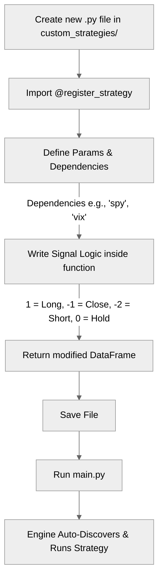

# Contributing to July Backtester

Thank you for your interest in contributing! This guide covers everything you need to get started: dev environment setup, adding strategies, running tests, and the PR checklist.

## Dev Environment Setup

```bash
# 1. Fork and clone
git clone https://github.com/<your-username>/july-backtester.git
cd july-backtester

# 2. Create a virtual environment
python -m venv venv
source venv/bin/activate        # macOS / Linux
venv\Scripts\activate.bat       # Windows CMD
venv\Scripts\Activate.ps1       # Windows PowerShell

# 3. Install dependencies
pip install -r requirements.txt

# 4. Set up your API key (optional — not needed for CSV or Yahoo provider)
cp .env.example .env
# Edit .env and add: POLYGON_API_KEY=your_key_here

# 5. Verify the setup
python main.py --dry-run
```

You should see a "RUN SUMMARY" box with strategy count, portfolio size, and task estimate. If that prints without errors, you're good to go.

## How to Add a New Strategy

The backtester uses a plugin system — no core files need editing. There are four steps:



### Step 1: Write the signal logic

If your logic is reusable across multiple strategies, add a function to `helpers/indicators.py`. Otherwise, write it inline in your plugin file (Step 2).

Your function receives a DataFrame `df` with columns `Open`, `High`, `Low`, `Close`, `Volume` and must populate `df['Signal']` before returning:

| Signal | Meaning              |
|--------|----------------------|
| `1`    | Enter / hold long    |
| `0`    | No change            |
| `-1`   | Exit / go flat       |
| `-2`   | Enter short          |

### Step 2: Create a plugin file

Drop a `.py` file into `custom_strategies/`. Any filename works as long as it doesn't start with `_`.

```python
# custom_strategies/my_strategy.py

from helpers.registry import register_strategy
from helpers.timeframe_utils import get_bars_for_period
from config import CONFIG

_TF  = CONFIG.get("timeframe", "D")
_MUL = CONFIG.get("timeframe_multiplier", 1)

@register_strategy(
    name="My Strategy Name",
    dependencies=[],               # add "spy" and/or "vix" if needed
    params={
        "length": get_bars_for_period("20d", _TF, _MUL),
    },
)

# If your strategy only signals on specific bars (not every bar),
# use the forward-fill pattern to maintain state:
#   df['Signal'] = df['Signal'].replace(0, np.nan).ffill().fillna(0)

def my_strategy(df, **kwargs):
    """Buy when price is above the 20-bar SMA."""
    length = kwargs["length"]
    df['SMA'] = df['Close'].rolling(length).mean()
    df['Signal'] = 0
    df.loc[df['Close'] > df['SMA'], 'Signal'] = 1
    df.loc[df['Close'] <= df['SMA'], 'Signal'] = -1
    return df
```

### Step 3: Verify discovery

```bash
python main.py --dry-run
```

Check that "Strategies: N" increased by 1.

### Step 4: Run a quick backtest

Test on a small portfolio to confirm everything works end-to-end:

```bash
# Temporarily set in config.py:
#   "portfolios": {"Test": ["SPY", "QQQ", "AAPL"]},
python main.py
```

Review the terminal summary table for your strategy's row.

## How to Run the Test Suite

```bash
# Run all tests
pytest

# Run a specific test file
pytest tests/test_indicators.py

# Run with verbose output
pytest -v

# Run a single test
pytest tests/test_indicators.py::test_sma_crossover_signal
```

All tests should pass before opening a PR. If a test requires patching `config.py` defaults, use `monkeypatch` fixtures (see `conftest.py` for existing patterns).

## PR Checklist

Before opening a pull request, confirm each of the following:

- [ ] **Tests pass** — `pytest` runs green with no failures
- [ ] **CLAUDE.md updated** — if you added a strategy, indicator, config key, or changed behavior, update the relevant section in `CLAUDE.md`
- [ ] **No hardcoded API keys** — secrets belong in `.env`, never in code
- [ ] **No data artifacts** — `data_cache/`, `output/`, `.env`, and parquet files are gitignored and must not be committed
- [ ] **Strategy naming** — if you added a strategy, the `name` in `@register_strategy` matches the format used by other strategies (e.g., `"SMA Crossover (20d/50d)"`)
- [ ] **Docstrings** — new functions have a one-paragraph docstring explaining what they do, their signal convention, and parameters
- [ ] **Dry run** — `python main.py --dry-run` completes without errors

## Code Style

- No strict linter is enforced, but keep code consistent with the existing style.
- Use `get_bars_for_period()` instead of raw integers for lookback parameters — this keeps strategies timeframe-agnostic.
- Sub-daily strategies should guard registration with `if _TF == "MIN":` so they don't raise `ValueError` when running on daily bars.
- Signal convention: `1` = enter/hold long, `-1` = exit/flat, `0` = no change, `-2` = enter short.
- The forward-fill pattern (`df['Signal'].replace(0, np.nan).ffill().fillna(0)`) is used by most strategies to maintain state between discrete entry/exit events.

## Testing Notes

- `conftest.py` forces `matplotlib.use("Agg")` for headless/CI environments. Don't remove it.
- If a test needs to override `config.py` values (e.g., `wfa_folds`), use `monkeypatch` to patch `CONFIG` — don't modify `config.py` directly in tests.
- Tests that need file I/O should use `tmp_path` fixtures (see `tests/test_csv_service.py` for examples).
- Run the full suite with `pytest -v` before submitting.

## Do Not Touch

These files are stable and should not be modified without Zach's explicit approval:

- `helpers/indicators.py` — all strategy signal logic (working correctly)
- `helpers/simulations.py` and `helpers/portfolio_simulations.py` — simulation engines
- `helpers/monte_carlo.py` — MC robustness scoring
- `tickers_to_scan/` — JSON ticker lists
- The multiprocessing architecture in `main.py` (`init_worker`, `run_single_simulation`, `Pool`)