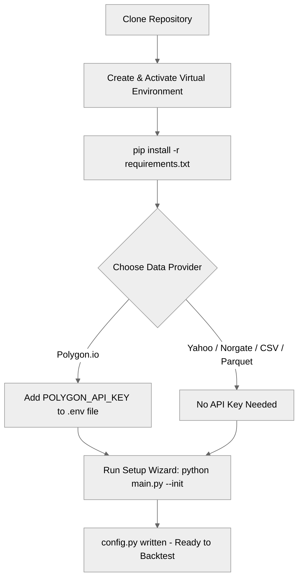
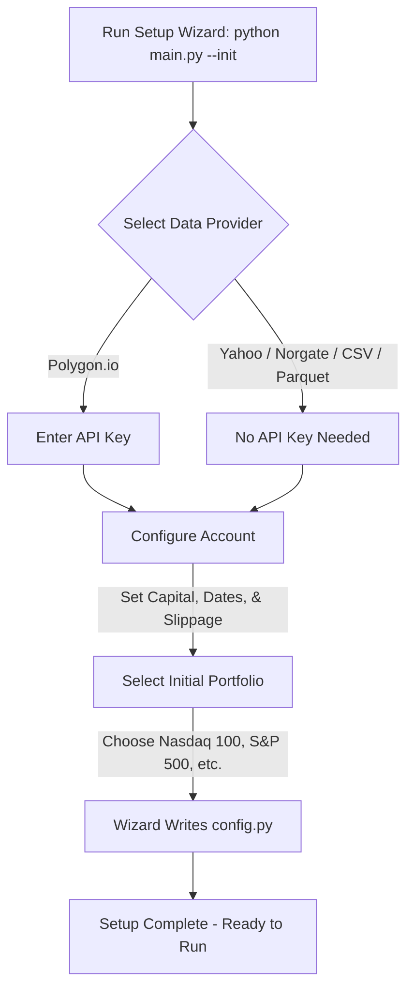
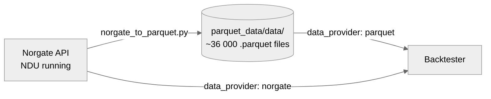
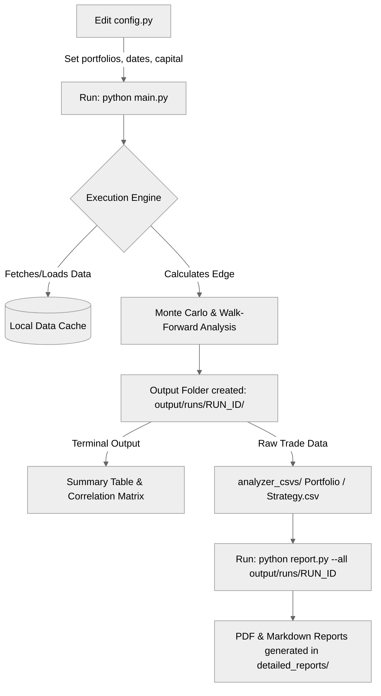

# July Backtester

> A professional-grade Python engine for stress-testing US equity strategies with Monte Carlo simulation and Walk-Forward Analysis.


[](https://github.com/zachisit/july-backtester/actions/workflows/tests.yml)

---

Tests trading strategies against full historical US equity data, runs 1,000-path Monte Carlo simulation and Walk-Forward Analysis to separate genuine edges from curve-fitting, and produces a summary table with Sharpe, Calmar, Win Rate, MC Score, WFA Verdict, and SPY/QQQ outperformance. Detailed PDF tearsheets include equity curves, drawdown plots, R-Multiple histograms, and VIX regime heatmaps.

**Intraday support**: Backtest on hourly (1H, 4H), 5-minute, 15-minute, or 30-minute bars with automatic metrics annualization (Sharpe, Sortino, HTB fees).

Supports Polygon, Norgate, Yahoo Finance, local CSV, and local Parquet. Free to run against Yahoo Finance with no API key.

Full reference: [docs/README_full.md](docs/README_full.md)

---

## Installation

```bash
git clone https://github.com/zachisit/july-backtester.git
cd july-backtester
python -m venv venv
source venv/bin/activate   # Windows: venv\Scripts\activate.bat
pip install -r requirements.txt
```

For Polygon data, add your API key to `.env` (copy `.env.example` to get started):

```env
POLYGON_API_KEY=your_key_here
```

**For interns with private strategies**: After cloning, initialize the private strategies submodule:

```bash
git submodule update --init --recursive
```

See [PRIVATE_STRATEGIES.md](PRIVATE_STRATEGIES.md) for the full guide.

---

## Quick Start



**First time?** Run the setup wizard:

```bash
python main.py --init
```



**Or manually** — set these lines in `config.py` and run:

```python
"data_provider": "yahoo",
"portfolios": {"My Symbols": ["SPY"]},
"start_date": "2010-01-01",
"initial_capital": 100000.0,
```

```bash
python main.py
```

The engine runs every strategy in `custom_strategies/` against SPY, prints a results table, and writes output to `output/runs/<timestamp>/`.

**Portfolio run** — test all strategies against the Nasdaq 100:

```python
"data_provider": "polygon",
"portfolios": {
    "Nasdaq 100": "nasdaq_100.json",
},
```

Validate before a long run: `python main.py --dry-run`

See [examples/](examples/) for ready-to-use config files and annotated strategy examples.

---

## Norgate Data

If you have a Norgate license, you can either query Norgate live on every run **or** export the full database to local Parquet files once and share access with teammates who don't have a license.

| Setting | What it does | Requires |
|---|---|---|
| `data_provider: "norgate"` | Calls Norgate API live on every run | Norgate license + NDU running |
| `data_provider: "parquet"` | Reads pre-exported local Parquet files | Submodule only — no license needed |

### Pipeline



### Exporting Norgate data to Parquet

Run the three export commands once (full dump, ~36 000 symbols, ~2.5 GB):

```bash
python scripts/norgate_to_parquet.py --database "US Equities"          --output-dir parquet_data/data --start-date 1990-01-01
python scripts/norgate_to_parquet.py --database "US Equities Delisted" --output-dir parquet_data/data --start-date 1990-01-01 --skip-existing
python scripts/norgate_to_parquet.py --database "US Indices"           --output-dir parquet_data/data --start-date 1990-01-01 --skip-existing
```

Validate that every Norgate symbol has a local file:

```bash
python scripts/validate_norgate_export.py
```

See [scripts/NORGATE_EXPORT.md](scripts/NORGATE_EXPORT.md) for the full export and validation guide.

### Accessing the exported data (interns / no-license teammates)

The exported dataset lives in the `parquet_data/` git submodule (private repo: `july-backtester-norgate-data`). Clone it alongside the main repo:

```bash
git clone --recurse-submodules https://github.com/zachisit/july-backtester.git
```

Or, if you already cloned without `--recurse-submodules`:

```bash
git submodule update --init parquet_data
```

Then set `data_provider: "parquet"` in `config.py`. No Norgate license or NDU process required.

---

### The Backtesting Lifecycle



---

## CLI Flags

Every setting in `config.py` can be overridden at runtime — no file editing required.

### Built-in flags

| Flag | Description |
| --- | --- |
| *(none)* | Full backtest run |
| `--init` | Launch the first-time setup wizard |
| `--dry-run` | Validate config and print run summary without fetching data |
| `--name <label>` | Prefix the output folder with a custom label |
| `--verbose` | Print Extended Metrics and Robustness tables |
| `--help-config [category]` | Print a guided tour of all config options with live defaults |

### Config override flags

Pass any of these to override `config.py` for a single run:

**Data**
```
--provider <str>          norgate | yahoo | polygon | csv | parquet
--csv-dir <path>          CSV folder (--provider csv only)
--parquet-dir <path>      Parquet folder (--provider parquet only)
```

**Period & Capital**
```
--start <YYYY-MM-DD>      Backtest start date
--end   <YYYY-MM-DD>      Backtest end date
--capital <float>         Starting equity in USD
```

**Portfolio & Symbols** *(mutually exclusive)*
```
--symbols AAPL MSFT …     Inline ticker list → runs as 'CLI' portfolio
--portfolio nasdaq_100.json   JSON file or norgate:WatchlistName
--min-bars <int>          Skip symbols with fewer bars
```

**Strategies**
```
--strategies "Name 1" "Name 2"   Exact strategy names to run
--strategies all                 Run every registered strategy
```

**Execution & Costs**
```
--allocation <float>      Fraction of equity per position (e.g. 0.05)
--execution open|close    Fill time
--slippage <float>        Bid/ask slippage fraction
--commission <float>      Commission per share in USD
--risk-free-rate <float>  Annual risk-free rate for Sharpe
--htb-rate <float>        Annual hard-to-borrow rate for shorts
--max-pct-adv <float>     Max fraction of 20d ADV per order
--volume-impact <float>   Sqrt market-impact coefficient (0 = off)
```

**Stop Loss** *(repeatable)*
```
--stop none               No stop
--stop pct:0.05           5% percentage stop
--stop atr:14:3.0         ATR stop (period=14, multiplier=3.0)
--stop pct:0.05 atr:14:3.0   Run both variants in one pass
```

**Filtering**
```
--min-pandl <float>       Min P&L % to show (-9999 = show all)
--max-dd <float>          Max drawdown to show (1.0 = show all)
--min-mc-score <float>    Min MC score to show
--min-vs-spy <float>      Min outperformance vs SPY
```

**Monte Carlo**
```
--mc-sims <int>           Number of MC simulations
--min-trades-mc <int>     Min trades required to run MC
--mc-sampling iid|block   Resampling method
```

**Walk-Forward Analysis**
```
--wfa-split <float>       In-sample fraction (0 = disable WFA)
--wfa-folds <int>         Rolling WFA folds (0 = disable)
```

**Output & Misc**
```
--save-trades / --no-save-trades
--save-filtered-only / --no-save-filtered-only
--noise <float>           OHLC noise injection fraction (0 = off)
--rolling-sharpe <int>    Rolling Sharpe window in bars (0 = off)
--export-ml / --no-export-ml
--upload-s3 / --no-upload-s3
```

**Escape hatch — any config key not covered above**
```
--set KEY=VALUE           Auto-cast to int/float/bool/str. Repeatable.
  e.g.  --set rolling_sharpe_window=252 --set htb_rate_annual=0.15
```

### Guided help

```bash
python main.py --help-config              # full reference with live defaults
python main.py --help-config data         # DATA section only
python main.py --help-config wfa          # WFA section only
# categories: data, period, portfolio, strategies, costs, stop,
#             filtering, mc, wfa, output
```

### Example commands

```bash
# Quick single-ticker run on Yahoo Finance
python main.py --provider yahoo --symbols AAPL --start 2020-01-01 --capital 25000

# Scan Nasdaq 100, only show strategies that beat SPY
python main.py --portfolio nasdaq_100.json --min-vs-spy 0.0

# Test three stop-loss variants in one pass
python main.py --stop none pct:0.05 atr:14:3.0

# Stress test with noise + block-bootstrap MC
python main.py --noise 0.01 --mc-sampling block --mc-sims 2000

# Override keys not covered by a named flag
python main.py --set rolling_sharpe_window=252 --set htb_rate_annual=0.15
```

---

## Contributing

See [CONTRIBUTING.md](CONTRIBUTING.md) for dev setup, how to add a strategy plugin, and the PR checklist.

---

## License

[MIT License](LICENSE)
