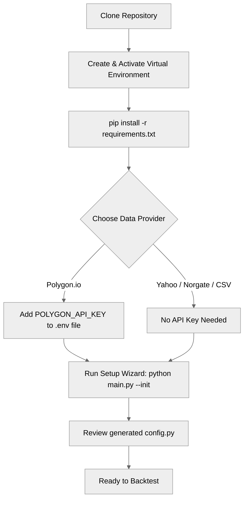
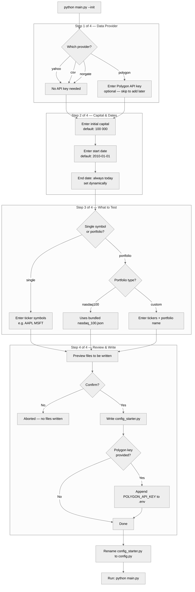
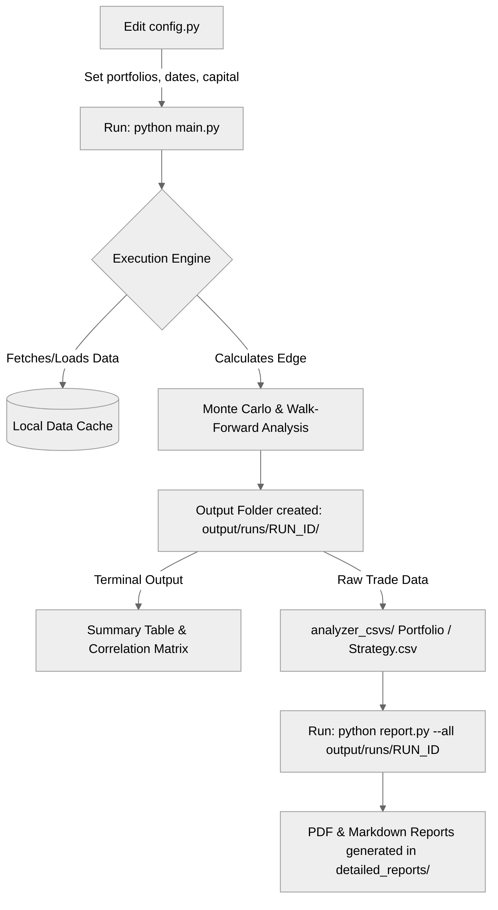

# July Backtester

> A professional-grade Python engine for stress-testing US equity strategies with Monte Carlo simulation and Walk-Forward Analysis.


[](https://github.com/zachisit/july-backtester/actions/workflows/tests.yml)

---

Tests trading strategies against full historical US equity data, runs 1,000-path Monte Carlo simulation and Walk-Forward Analysis to separate genuine edges from curve-fitting, and produces a summary table with Sharpe, Calmar, Win Rate, MC Score, WFA Verdict, and SPY/QQQ outperformance. Detailed PDF tearsheets include equity curves, drawdown plots, R-Multiple histograms, and VIX regime heatmaps.

Supports Polygon, Norgate, Yahoo Finance, and local CSV. Free to run against Yahoo Finance with no API key.

Full reference: [docs/README_full.md](docs/README_full.md)

---

## Installation

```bash
git clone https://github.com/zachisit/july-backtester.git
cd july-backtester
python -m venv venv
source venv/bin/activate   # Windows: venv\Scripts\activate.bat
pip install -r requirements.txt
```

For Polygon data, add your API key to `.env` (copy `.env.example` to get started):

```env
POLYGON_API_KEY=your_key_here
```

---

## Quick Start



**First time?** Run the setup wizard:

```bash
python main.py --init
```



**Or manually** — set these lines in `config.py` and run:

```python
"data_provider": "yahoo",
"symbols_to_test": ["SPY"],
"start_date": "2010-01-01",
"initial_capital": 100000.0,
```

```bash
python main.py
```

The engine runs every strategy in `custom_strategies/` against SPY, prints a results table, and writes output to `output/runs/<timestamp>/`.

**Portfolio run** — test all strategies against the Nasdaq 100:

```python
"data_provider": "polygon",
"portfolios": {
    "Nasdaq 100": "nasdaq_100.json",
},
```

Validate before a long run: `python main.py --dry-run`

See [examples/](examples/) for ready-to-use config files and annotated strategy examples.

### The Backtesting Lifecycle



---

## CLI Flags

| Flag | Description |
| --- | --- |
| *(none)* | Full backtest run |
| `--init` | Launch the first-time setup wizard |
| `--dry-run` | Validate config and print run summary without fetching data |
| `--name <label>` | Prefix the output folder with a custom label |

---

## Contributing

See [CONTRIBUTING.md](CONTRIBUTING.md) for dev setup, how to add a strategy plugin, and the PR checklist.

---

## License

[MIT License](LICENSE)
