# Nasdaq 100 Sma Crossover 20D 50D Trade Log
---

## Data Cleaning Summary

```text
Initial trades loaded: 1761
Rows dropped due to NaN in critical columns (Profit, % Profit, Date, Ex. date): 0
NaN Counts per Critical Column:
Profit      0
% Profit    0
Date        0
Ex. date    0

Sample of Dropped/Problematic Rows (if any):
None (No rows dropped)

Final Trade Count for Analysis: 1761
```

## Overall Performance Metrics

```text
Total Net Profit:                             $2,527,081.10
Total Trades:                                 1,761
Total Shares Purchased:                       3,030,471
Strategy Total Return:                        5054.16%

Gross Profit:                                 $6,612,332.91
Gross Loss:                                   $-4,085,251.81
Profit Factor:                                1.62

Win Rate:                                     46.22%
Average Winning Trade:                        $8,123.26
Average Losing Trade:                         $-4,313.89
Average Trade Profit:                         $1,435.03
Ratio Avg Win / Avg Loss:                     1.88

Max Consecutive Wins:                         11
Max Consecutive Losses:                       23

Expectancy per Trade:                         $1,435.03

Total Duration:                               22.02 years (8044 days)
Average Trades per Year:                      80.0
CAGR:                                         19.60%
Estimated After-Tax CAGR (30% tax):           17.73%
Annual Turnover:                              9824.64%

Sharpe Ratio (Ann., Portfolio Daily, Rf=0.0%): 0.91
Sortino Ratio (Ann., Portfolio Daily, Rf=0.0%): 0.73
Calmar Ratio (CAGR / Max Equity DD%):         0.36
Max Equity Drawdown:                          53.99%

Sharpe (Per Trade, Arith Ret, Non-Ann, Rf=0%): 0.16
Sharpe (Per Trade, Log Ret, Non-Ann, Rf=0%):  0.16

Tail Risk Analysis (Based on Trade Profit $):
--------------------------------------------------
95% Value at Risk (VaR):                      $-13,213.64
95% Conditional VaR (CVaR):                   $-24,986.99
99% Value at Risk (VaR):                      $-31,926.00
99% Conditional VaR (CVaR):                   $-49,296.39

Benchmark Comparison (SPY):
--------------------------------------------------
SPY Buy & Hold Return (period):               490.67%
Beta vs SPY:                                  -0.00
Alpha vs SPY (Ann., Rf=0.0%):                 19.65%
```

## Walk-Forward Analysis (WFA)

```text
WFA is disabled. Set WFA_SPLIT_RATIO (e.g. 0.80) to enable.
```

## Detailed Drawdown Analysis

```text
Max System Drawdown (Based on Equity %):      -53.99%

Drawdown Duration & Recovery Periods (Based on Cumulative Profit Peaks/Troughs):
---------------------------------------------------------------------------
Average Drawdown Duration (Trades):           13.9
Maximum Drawdown Duration (Trades):           251
Average Drawdown Duration (Days):             65
Maximum Drawdown Duration (Days):             1167

Average Recovery Time (Trades):               5.5
Maximum Recovery Time (Trades):               125
Average Recovery Time (Days):                 33
Maximum Recovery Time (Days):                 700

Definitions:
 - Duration: Time from equity peak to new equity peak.
 - Recovery Time: Time from drawdown trough to new equity peak.


Top 5 Largest Drawdown Periods (by $ Amount, based on Cum. Profit Peaks):
------------------------------------------------------------------------------------------
Start Date   Trough Date  End Date     Duration(d)   DD Amount($)    Peak Val($)    
------------------------------------------------------------------------------------
2021-12-17   2022-10-13   2024-04-16   851           723,248.85      2,010,616.36   
2025-11-12   2026-03-19   Ongoing      133           220,741.38      2,641,389.18   
2025-01-21   2025-03-13   2025-03-17   55            182,604.69      2,633,039.77   
2020-03-11   2020-03-24   2020-09-23   196           174,541.00      1,078,618.11   
2025-03-17   2025-08-18   2025-11-12   240           136,919.67      2,640,526.51
```

## Performance per Symbol Analysis

```text
Performance per Symbol (Sorted by Win Rate):
================================================================================
       Total_Trades Total_Profit Win_Rate  Avg_Profit    Avg_Loss Profit_Factor Avg_Pct_Return Avg_Bars_Held
Symbol                                                                                                      
WDAY              1   $10,698.70   100.0%  $10,698.70       $0.00           inf          0.15%         212.0
PYPL              2   $23,220.61   100.0%  $11,610.31       $0.00           inf          0.12%         107.5
SNPS              2    $4,219.41   100.0%   $2,109.71       $0.00           inf          0.06%          99.0
ORLY             11   $38,784.38    81.8%   $4,598.89  $-1,302.83         15.88          0.10%          79.9
NFLX             14   $79,098.70    78.6%   $7,568.20  $-1,383.85         20.05          0.22%          76.4
PANW              4   $30,142.39    75.0%  $13,067.67  $-9,060.62          4.33          0.15%         125.2
MELI              4    $3,634.76    75.0%   $1,212.27      $-2.05       1773.04          0.13%          73.8
ROST              8  $-32,896.93    75.0%   $2,666.00 $-24,446.45          0.33          0.03%          58.8
APP               7  $543,497.62    71.4% $130,025.70 $-53,315.43          6.10          0.44%          97.9
TMUS              7   $21,903.74    71.4%   $4,740.34    $-898.99         13.18          0.12%          80.0
LRCX              7    $8,123.20    71.4%   $2,035.78  $-1,027.85          4.95          0.08%          59.0
ZS                3  $151,269.42    66.7%  $89,827.32 $-28,385.21          6.33          0.52%         153.0
PCAR              6    $7,980.42    66.7%   $5,385.42  $-6,780.63          1.59          0.19%         123.5
COST             33   $68,515.91    66.7%   $5,468.37  $-4,708.02          2.32          0.04%          77.8
CDW              22   $16,553.70    63.6%   $3,656.71  $-4,330.03          1.48          0.03%          56.4
MSTR              8   $56,364.67    62.5%  $12,957.47  $-2,807.56          7.69          0.00%          48.2
TTWO              5   $40,236.56    60.0%  $13,573.26    $-241.61         84.27          0.07%          61.6
GILD             22   $55,395.24    59.1%   $6,065.23  $-2,605.86          3.36          0.06%          74.2
REGN             12   $34,719.33    58.3%   $7,052.84  $-2,930.10          3.37         -0.01%          60.2
CPRT             33   $45,190.29    57.6%   $3,909.62  $-2,078.03          2.55          0.03%          67.0
ODFL              7    $4,931.01    57.1%   $1,704.96    $-629.60          3.61          0.03%          68.4
MCHP              9    $5,714.00    55.6%   $1,816.10    $-841.62          2.70          0.03%          67.2
EXC              20    $5,820.78    55.0%   $3,083.74  $-3,122.26          1.21          0.03%          82.3
INTC             11   $-6,339.63    54.5%   $1,918.15  $-3,569.70          0.64          0.02%          48.5
AMGN             50   $26,665.98    54.0%   $3,934.62  $-3,459.51          1.34          0.02%          63.9
AVGO             36  $114,017.90    52.8%  $10,109.94  $-4,592.41          2.46          0.02%          58.9
CDNS             37   $32,217.20    51.4%   $2,863.77  $-1,233.03          2.45          0.02%          57.0
AMAT             53  $220,675.65    50.9%  $11,309.57  $-3,257.03          3.61          0.04%          50.2
DXCM             26  $-27,154.87    50.0%   $4,893.46  $-6,982.30          0.70          0.03%          56.8
META              2    $1,993.42    50.0%   $2,392.21    $-398.79          6.00          0.00%          70.0
MRVL              6   $46,980.28    50.0%  $16,921.94  $-1,261.85         13.41          0.14%          83.8
MU                2      $557.60    50.0%   $1,005.96    $-448.36          2.24          0.02%          43.0
ASML             42   $64,007.66    50.0%   $6,654.96  $-3,606.97          1.85          0.04%          61.6
DASH              4  $-42,766.66    50.0%   $8,233.78 $-29,617.11          0.28         -0.04%          22.2
ISRG             14   $-2,012.79    50.0%   $1,034.01  $-1,321.55          0.78          0.09%          69.1
INTU             12    $3,720.74    50.0%   $1,492.02    $-871.89          1.71          0.01%          46.3
PDD               4   $51,297.70    50.0%  $51,729.05 $-26,080.20          1.98          0.17%          73.5
NVDA              6    $7,387.67    50.0%   $2,484.83     $-22.27        111.57          0.12%          84.8
TRI               8    $8,835.45    50.0%   $2,756.50    $-547.64          5.03         -0.01%          50.6
TEAM              2   $25,611.77    50.0%  $26,367.60    $-755.83         34.89          0.13%          62.5
KLAC              8   $-9,844.85    50.0%   $1,502.19  $-3,963.40          0.38          0.02%          63.5
ROP               2       $-2.57    50.0%      $52.49     $-55.07          0.95         -0.02%           3.5
QCOM              4   $-2,290.77    50.0%     $277.34  $-1,422.73          0.19          0.00%          51.0
PAYX              2   $-1,170.35    50.0%      $15.13  $-1,185.48          0.01         -0.03%          43.5
MNST             12   $39,285.72    50.0%   $7,761.16  $-1,213.54          6.40          0.13%         116.8
KHC               4    $6,486.50    50.0%   $6,100.57  $-2,857.32          2.14          0.04%         102.8
GOOG             16   $39,421.92    50.0%   $9,667.19  $-4,739.45          2.04          0.04%          63.9
LIN              10    $2,900.99    50.0%   $1,744.53  $-1,164.33          1.50          0.01%          34.8
FTNT             10  $164,956.87    50.0%  $36,770.56  $-3,779.18          9.73          0.12%          70.8
IDXX             14   $25,947.48    50.0%   $4,173.62    $-466.83          8.94          0.02%          59.3
FANG             14  $-71,639.40    50.0%   $4,591.13 $-14,825.32          0.31         -0.01%          62.9
FAST             22   $77,064.84    50.0%   $8,600.16  $-1,594.27          5.39          0.01%          54.4
AAPL             59  $169,737.08    49.2%   $9,830.78  $-3,845.19          2.47          0.07%          80.8
CSCO             25   $76,616.21    48.0%   $8,253.30  $-1,724.87          4.42          0.04%          65.0
AXON             40  $424,639.57    47.5%  $33,720.25 $-10,287.86          2.97          0.08%          62.5
EA               19   $66,975.08    47.4%  $11,116.04  $-3,306.93          3.03          0.00%          63.2
HON              13   $-1,645.77    46.2%   $1,187.72  $-1,253.16          0.81          0.01%          38.2
CTAS             24  $145,599.88    45.8%  $15,904.60  $-2,257.75          5.96          0.05%          93.2
CTSH             22  $-19,844.12    45.5%     $927.84  $-2,426.87          0.32          0.01%          56.6
ADBE             55 $-107,004.30    45.5%   $2,935.60  $-6,013.15          0.41          0.01%          70.7
XEL              11     $-218.73    45.5%   $1,440.52  $-1,236.88          0.97          0.03%          90.6
BIIB             40    $6,023.94    45.0%   $6,546.98  $-5,082.81          1.05          0.01%          63.1
AEP              58   $35,406.83    44.8%   $3,691.36  $-1,892.77          1.58          0.01%          69.6
CRWD              9  $219,045.41    44.4%  $71,712.11 $-13,560.61          4.23          0.12%          80.6
ADI              63   $70,908.78    44.4%   $5,394.55  $-2,289.68          1.88          0.01%          55.1
AMZN             52   $37,425.00    44.2%   $7,696.84  $-4,813.88          1.27          0.03%          61.6
BKNG             43  $-24,308.64    44.2%   $6,548.14  $-6,196.80          0.84          0.11%          70.4
ADP              55   $14,720.16    43.6%   $5,125.58  $-3,493.35          1.14          0.01%          67.6
ADSK             53   $19,799.79    43.4%   $5,051.07  $-3,212.49          1.21          0.02%          62.8
GOOGL            12   $-9,519.34    41.7%   $1,125.56  $-2,163.88          0.37          0.02%          47.3
CHTR             22   $-6,899.61    40.9%   $4,826.79  $-3,872.36          0.86          0.01%          65.2
CSGP             30      $891.66    40.0%   $4,457.92  $-2,922.41          1.02          0.02%          53.7
SBUX              5   $28,008.84    40.0%  $14,048.71     $-29.53        317.20          0.04%          48.8
CMCSA            35  $-40,880.42    37.1%   $2,293.18  $-3,213.26          0.42         -0.01%          51.1
BKR              42  $-43,962.49    35.7%   $6,289.27  $-5,122.28          0.68         -0.01%          46.4
AZN              45   $30,728.17    35.6%   $4,924.10  $-1,657.15          1.64          0.01%          57.6
CCEP             45  $-42,374.69    35.6%   $3,917.83  $-3,622.76          0.60         -0.00%          59.4
ABNB             17 $-123,450.56    35.3%  $10,464.85 $-16,930.88          0.34         -0.03%          44.5
VRSK              3    $7,661.34    33.3%   $9,173.14    $-755.90          6.07          0.12%         105.3
LULU              9  $-18,587.72    33.3%   $2,277.39  $-4,236.65          0.27         -0.09%          20.0
DDOG              6  $-51,939.05    33.3%   $5,073.84 $-15,521.68          0.16         -0.03%          22.5
CSX              31   $-7,620.79    32.3%   $5,470.70  $-2,967.99          0.88          0.02%          60.3
MDLZ             13  $-28,379.94    30.8%     $205.59  $-3,244.70          0.03         -0.03%          30.6
KDP              10   $-7,968.28    30.0%   $2,780.91  $-2,330.14          0.51          0.02%          74.7
PEP               7   $-2,637.79    28.6%     $842.71    $-864.64          0.39         -0.03%          60.3
MAR              11  $-15,194.48    27.3%      $45.60  $-1,916.41          0.01         -0.01%          48.5
WBD               4    $8,157.99    25.0%   $9,497.98    $-446.66          7.09          0.16%         114.8
ON                4  $-55,827.98    25.0%      $75.64 $-18,634.54          0.00         -0.13%          25.8
AMD              51  $-49,297.54    23.5%  $10,397.06  $-4,463.13          0.72         -0.02%          46.8
CEG               9  $-23,031.31    22.2%  $46,596.28 $-16,603.41          0.80          0.01%          63.7
ARM               6  $-91,451.36    16.7%   $6,873.18 $-19,664.91          0.07         -0.08%          27.3
MSFT              6   $-6,188.93    16.7%     $829.99  $-1,403.78          0.12         -0.01%          24.5
VRTX              6   $-8,172.87    16.7%   $1,509.05  $-1,936.38          0.16         -0.05%          66.7
GEHC              2   $-6,807.96     0.0%       $0.00  $-3,403.98          0.00         -0.03%          39.0
GFS               2  $-17,683.70     0.0%       $0.00  $-8,841.85          0.00         -0.11%          10.5
NXPI              1  $-31,662.47     0.0%       $0.00 $-31,662.47          0.00         -0.17%          27.0
PLTR              1   $-2,071.70     0.0%       $0.00  $-2,071.70          0.00         -0.20%          53.0
SHOP              1   $-3,754.67     0.0%       $0.00  $-3,754.67          0.00         -0.04%           2.0
TSLA              3   $-6,093.50     0.0%       $0.00  $-2,031.17          0.00         -0.04%          22.0
TTD               1     $-713.31     0.0%       $0.00    $-713.31          0.00         -0.06%           7.0

Symbols with Profit Factor < 1.00 (Sorted by PF):
================================================================================
       Total_Trades Total_Profit Win_Rate Profit_Factor
Symbol                                                 
NXPI              1  $-31,662.47     0.0%          0.00
TTD               1     $-713.31     0.0%          0.00
TSLA              3   $-6,093.50     0.0%          0.00
SHOP              1   $-3,754.67     0.0%          0.00
GEHC              2   $-6,807.96     0.0%          0.00
PLTR              1   $-2,071.70     0.0%          0.00
GFS               2  $-17,683.70     0.0%          0.00
ON                4  $-55,827.98    25.0%          0.00
MAR              11  $-15,194.48    27.3%          0.01
PAYX              2   $-1,170.35    50.0%          0.01
MDLZ             13  $-28,379.94    30.8%          0.03
ARM               6  $-91,451.36    16.7%          0.07
MSFT              6   $-6,188.93    16.7%          0.12
VRTX              6   $-8,172.87    16.7%          0.16
DDOG              6  $-51,939.05    33.3%          0.16
QCOM              4   $-2,290.77    50.0%          0.19
LULU              9  $-18,587.72    33.3%          0.27
DASH              4  $-42,766.66    50.0%          0.28
FANG             14  $-71,639.40    50.0%          0.31
CTSH             22  $-19,844.12    45.5%          0.32
ROST              8  $-32,896.93    75.0%          0.33
ABNB             17 $-123,450.56    35.3%          0.34
GOOGL            12   $-9,519.34    41.7%          0.37
KLAC              8   $-9,844.85    50.0%          0.38
PEP               7   $-2,637.79    28.6%          0.39
ADBE             55 $-107,004.30    45.5%          0.41
CMCSA            35  $-40,880.42    37.1%          0.42
KDP              10   $-7,968.28    30.0%          0.51
CCEP             45  $-42,374.69    35.6%          0.60
INTC             11   $-6,339.63    54.5%          0.64
BKR              42  $-43,962.49    35.7%          0.68
DXCM             26  $-27,154.87    50.0%          0.70
AMD              51  $-49,297.54    23.5%          0.72
ISRG             14   $-2,012.79    50.0%          0.78
CEG               9  $-23,031.31    22.2%          0.80
HON              13   $-1,645.77    46.2%          0.81
BKNG             43  $-24,308.64    44.2%          0.84
CHTR             22   $-6,899.61    40.9%          0.86
CSX              31   $-7,620.79    32.3%          0.88
ROP               2       $-2.57    50.0%          0.95
XEL              11     $-218.73    45.5%          0.97
```

## Profitable vs. Unprofitable Symbol Comparison

```text
Comparison based on PF >= 1.50 vs PF < 1.00

Profitable Symbols (50 symbols, 839 trades):
  Avg % Profit per Trade: 0.05%
  Avg Bars Held: 67.91
  Overall Win Rate: 51.73%

Unprofitable Symbols (41 symbols, 590 trades):
  Avg % Profit per Trade: 0.01%
  Avg Bars Held: 54.85
  Overall Win Rate: 37.80%

Interpretation Notes:
- Compare Avg Bars Held, Avg % Profit, Win Rate between groups.
```

## Monthly Net Profit Plot

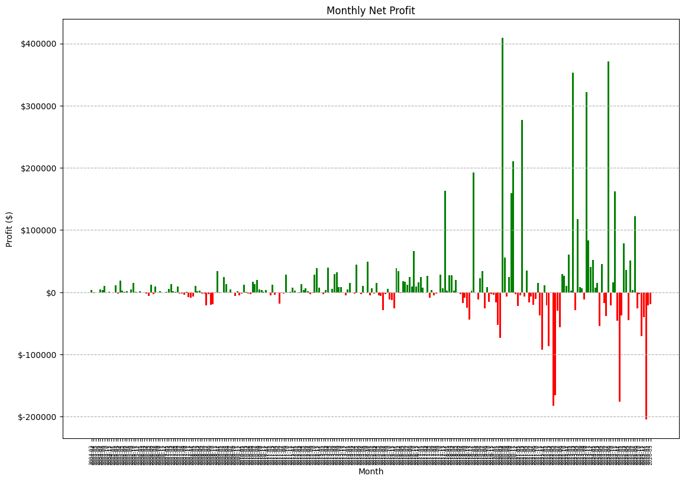

## Top 5 Losing Symbol Contributors During Losing Months

```text
Month: 2004-04 (Total Loss: $-853.12)
 Symbol  Contribution
    AMD      $-603.09
    EXC      $-395.70

Month: 2004-05 (Total Loss: $-661.78)
 Symbol  Contribution
   GILD      $-839.67
    CSX      $-210.97
   IDXX      $-177.15
   AMZN      $-165.98
    BKR       $-82.84

Month: 2004-06 (Total Loss: $-113.30)
 Symbol  Contribution
   AAPL      $-113.30

Month: 2004-10 (Total Loss: $-104.03)
 Symbol  Contribution
    ADI      $-636.80
    AMD       $-14.81

Month: 2004-12 (Total Loss: $-516.93)
 Symbol  Contribution
   AMAT      $-516.93

Month: 2005-01 (Total Loss: $-1,612.05)
 Symbol  Contribution
   AMZN    $-1,170.51
     EA      $-961.49
   BKNG      $-911.12
   CPRT      $-501.54
  CMCSA      $-196.11

Month: 2005-03 (Total Loss: $-1,791.01)
 Symbol  Contribution
   ADBE      $-846.76
    AMD      $-570.00
    ADP      $-228.53
   BKNG      $-105.75
   AMAT       $-35.00

Month: 2005-12 (Total Loss: $-310.10)
 Symbol  Contribution
   AMAT      $-487.80

Month: 2006-02 (Total Loss: $-435.18)
 Symbol  Contribution
    ADI    $-1,580.32
    EXC      $-342.16
  CMCSA      $-249.85

Month: 2006-03 (Total Loss: $-91.19)
 Symbol  Contribution
    ADP      $-724.54
   BIIB      $-416.02
   CDNS      $-264.43
   CTAS       $-86.69
   CSGP        $-0.78

Month: 2006-04 (Total Loss: $-2,163.13)
 Symbol  Contribution
   ADSK    $-2,036.08
    BKR      $-127.05

Month: 2006-05 (Total Loss: $-6,325.05)
 Symbol  Contribution
   AAPL    $-2,333.58
   ASML    $-1,749.86
   ADBE    $-1,551.57
    CSX    $-1,288.54
   AMAT    $-1,139.00

Month: 2006-07 (Total Loss: $-3,002.78)
 Symbol  Contribution
   GOOG    $-1,949.04
  GOOGL    $-1,672.84
   INTC       $-90.24
   COST       $-30.23

Month: 2006-09 (Total Loss: $-18.98)
 Symbol  Contribution
   ADBE       $-39.94

Month: 2006-11 (Total Loss: $-303.77)
 Symbol  Contribution
   AMAT      $-249.50
   AXON       $-78.41

Month: 2006-12 (Total Loss: $-427.98)
 Symbol  Contribution
   BIIB      $-315.11
   CCEP      $-121.65
    BKR        $-7.26
   ASML        $-1.75

Month: 2007-07 (Total Loss: $-1,852.29)
 Symbol  Contribution
    AMD    $-1,644.40
    CSX      $-558.94
    AZN      $-181.47
  CMCSA      $-123.23
    ADI       $-53.32

Month: 2007-08 (Total Loss: $-2,505.77)
 Symbol  Contribution
   FAST    $-1,906.90
   KLAC      $-741.36
   CSGP      $-568.48
    EXC      $-377.46
     ON      $-304.44

Month: 2007-09 (Total Loss: $-4,423.87)
 Symbol  Contribution
   MNST    $-2,600.83
   PAYX    $-1,185.48
   ADBE      $-803.09

Month: 2007-11 (Total Loss: $-7,539.12)
 Symbol  Contribution
    XEL    $-1,929.06
    EXC    $-1,791.75
    ADP    $-1,663.00
   MSTR    $-1,254.44
   AMGN      $-909.61

Month: 2007-12 (Total Loss: $-9,264.65)
 Symbol  Contribution
   AAPL    $-5,815.07
   MDLZ    $-1,503.38
   ADSK    $-1,184.66
    AEP      $-563.03
   AMZN      $-127.74

Month: 2008-01 (Total Loss: $-6,752.97)
 Symbol  Contribution
   CTSH    $-2,963.55
   REGN    $-2,924.52
   DXCM    $-2,745.58
    AEP    $-2,230.43
   CPRT    $-1,996.95

Month: 2008-05 (Total Loss: $-2,562.72)
 Symbol  Contribution
   ADSK    $-2,398.39
    ADP      $-164.32

Month: 2008-06 (Total Loss: $-1,867.23)
 Symbol  Contribution
    AMD    $-5,200.41
   AMAT    $-2,440.98
    BKR      $-864.91
   CSGP      $-271.68
   CPRT      $-137.68

Month: 2008-07 (Total Loss: $-20,818.22)
 Symbol  Contribution
   BIIB    $-3,986.35
   QCOM    $-2,845.46
   CTSH    $-2,669.23
   ISRG    $-2,087.67
   IDXX    $-2,067.70

Month: 2008-08 (Total Loss: $-3,080.33)
 Symbol  Contribution
   ADBE    $-2,215.59
   CTAS      $-864.73

Month: 2008-09 (Total Loss: $-20,108.48)
 Symbol  Contribution
   FAST    $-4,272.22
   INTU    $-2,991.06
   AXON    $-2,348.16
   AMZN    $-2,043.91
    AMD    $-2,041.61

Month: 2008-10 (Total Loss: $-18,882.63)
 Symbol  Contribution
   LULU    $-5,749.17
   VRTX    $-3,246.35
   REGN    $-2,660.79
   NFLX    $-2,316.39
   MNST    $-2,057.89

Month: 2008-11 (Total Loss: $-982.96)
 Symbol  Contribution
   AMGN      $-572.89
   GILD      $-410.07

Month: 2009-01 (Total Loss: $-877.03)
 Symbol  Contribution
    AEP    $-1,246.69

Month: 2009-02 (Total Loss: $-89.64)
 Symbol  Contribution
   CCEP    $-1,707.85
   BIIB    $-1,369.00
   ASML    $-1,322.67
    BKR      $-396.87
   AXON      $-264.83

Month: 2009-06 (Total Loss: $-1,745.51)
 Symbol  Contribution
    AMD    $-2,306.00
    ADP    $-1,754.20
   AMAT       $-58.47

Month: 2009-10 (Total Loss: $-6,175.46)
 Symbol  Contribution
   CDNS    $-3,406.07
    BKR    $-2,558.87
   CCEP      $-674.35
   CSCO      $-266.48
   BIIB       $-44.15

Month: 2009-12 (Total Loss: $-5,495.59)
 Symbol  Contribution
    AMD    $-3,225.43
   AMAT    $-2,134.52
    ADI      $-141.21

Month: 2010-01 (Total Loss: $-2,654.43)
 Symbol  Contribution
   AAPL    $-1,282.04
   AXON      $-900.94
   ASML      $-256.21
   ADSK      $-190.32
   AVGO      $-125.67

Month: 2010-04 (Total Loss: $-2,083.23)
 Symbol  Contribution
   AMAT      $-868.87
    AMD      $-441.35
    ADI      $-419.30
    ADP      $-288.29
    AEP       $-65.42

Month: 2010-05 (Total Loss: $-3,166.46)
 Symbol  Contribution
   CSGP    $-1,239.32
   AMZN    $-1,106.44
    BKR      $-671.84
   BKNG      $-616.34
     EA      $-611.64

Month: 2011-01 (Total Loss: $-455.06)
 Symbol  Contribution
   ADBE      $-455.06

Month: 2011-02 (Total Loss: $-4,899.78)
 Symbol  Contribution
    AMD    $-2,801.71
    AZN    $-1,304.64
   AMGN      $-546.54
    AEP      $-291.41

Month: 2011-04 (Total Loss: $-4,192.15)
 Symbol  Contribution
   CSGP    $-1,878.31
   CTSH    $-1,408.98
   ADSK      $-894.58
   CPRT       $-10.29

Month: 2011-05 (Total Loss: $-1,295.70)
 Symbol  Contribution
   ADBE    $-1,113.00
    AMD      $-142.43
    ADI       $-84.25

Month: 2011-06 (Total Loss: $-18,457.45)
 Symbol  Contribution
   MSTR    $-7,052.99
   AVGO    $-3,153.37
     EA    $-2,607.05
   ORLY    $-1,897.79
   CTAS    $-1,566.48

Month: 2011-07 (Total Loss: $-1,177.66)
 Symbol  Contribution
   AAPL    $-1,177.66

Month: 2011-08 (Total Loss: $-1,888.03)
 Symbol  Contribution
   LULU    $-5,341.12
   BKNG    $-3,127.56
    BKR    $-1,921.94
    ADP    $-1,297.33
   GOOG      $-976.65

Month: 2011-10 (Total Loss: $-902.38)
 Symbol  Contribution
   ADBE      $-902.38

Month: 2012-03 (Total Loss: $-1,402.81)
 Symbol  Contribution
    AMD    $-1,790.92
    ADP      $-647.74

Month: 2012-08 (Total Loss: $-2,703.82)
 Symbol  Contribution
   ASML    $-2,675.02
    AZN       $-28.80

Month: 2012-09 (Total Loss: $-939.81)
 Symbol  Contribution
   ADBE      $-795.24
   AMAT      $-144.56

Month: 2013-01 (Total Loss: $-877.86)
 Symbol  Contribution
   ADSK      $-989.75

Month: 2013-02 (Total Loss: $-2,777.28)
 Symbol  Contribution
   AMAT    $-1,888.90
    AMD      $-886.71
   AMZN        $-1.67

Month: 2013-05 (Total Loss: $-171.93)
 Symbol  Contribution
   AAPL      $-171.93

Month: 2013-11 (Total Loss: $-944.06)
 Symbol  Contribution
    ADI    $-1,145.27

Month: 2013-12 (Total Loss: $-4,645.63)
 Symbol  Contribution
    AMD    $-4,158.02
   AMZN    $-2,130.50

Month: 2014-03 (Total Loss: $-312.04)
 Symbol  Contribution
   AAPL      $-229.80
    ADI       $-82.25

Month: 2014-04 (Total Loss: $-2,048.56)
 Symbol  Contribution
   ASML    $-5,396.49
   ISRG    $-2,861.60
   FAST    $-1,963.32
    EXC    $-1,832.60
    ADP    $-1,350.32

Month: 2014-06 (Total Loss: $-81.70)
 Symbol  Contribution
   ADBE       $-81.70

Month: 2014-07 (Total Loss: $-3,307.76)
 Symbol  Contribution
    ADI    $-2,730.70
   ADSK      $-749.18

Month: 2014-09 (Total Loss: $-298.61)
 Symbol  Contribution
   ADBE    $-3,064.70
   AMAT    $-2,168.03
    AZN      $-135.01

Month: 2015-01 (Total Loss: $-5,024.87)
 Symbol  Contribution
   AXON    $-9,905.30
  CMCSA    $-2,273.60
   AMAT    $-1,800.30
    ADI      $-827.06
   CCEP      $-748.52

Month: 2015-03 (Total Loss: $-2,051.10)
 Symbol  Contribution
   ADBE    $-2,257.40
   AMGN       $-15.81
   ADSK        $-2.98

Month: 2015-05 (Total Loss: $-4,955.85)
 Symbol  Contribution
    ADP    $-3,051.60
   ADBE    $-1,572.75
   ASML      $-244.06
   CDNS       $-75.84
    AEP       $-22.75

Month: 2015-06 (Total Loss: $-5,994.87)
 Symbol  Contribution
   CTSH    $-3,146.68
   AVGO    $-2,558.21
   FAST    $-2,013.72
    CSX      $-399.61
   DXCM        $-5.08

Month: 2015-07 (Total Loss: $-28,811.90)
 Symbol  Contribution
   BIIB   $-15,152.87
   AMGN    $-6,052.59
   CPRT    $-2,736.19
  CMCSA    $-1,964.17
   GOOG    $-1,894.06

Month: 2015-08 (Total Loss: $-3,431.31)
 Symbol  Contribution
   ADSK    $-6,998.90
    AZN    $-2,490.25

Month: 2015-10 (Total Loss: $-12,157.74)
 Symbol  Contribution
    ADI    $-5,878.15
    BKR    $-5,142.27
    ADP      $-819.98
    AEP      $-553.12

Month: 2015-11 (Total Loss: $-12,660.07)
 Symbol  Contribution
   AAPL    $-5,289.96
   ADSK    $-4,314.46
   AMGN    $-3,055.65

Month: 2015-12 (Total Loss: $-25,671.33)
 Symbol  Contribution
   CPRT    $-5,605.47
    AMD    $-4,639.33
    AZN    $-4,568.40
   BIIB    $-3,501.22
   FAST    $-2,554.68

Month: 2016-04 (Total Loss: $-1,313.40)
 Symbol  Contribution
   AAPL    $-1,313.40

Month: 2017-03 (Total Loss: $-143.33)
 Symbol  Contribution
   ASML      $-143.33

Month: 2017-05 (Total Loss: $-8,700.82)
 Symbol  Contribution
   AXON   $-12,665.53
   CHTR    $-4,590.56

Month: 2017-07 (Total Loss: $-5,537.81)
 Symbol  Contribution
    CSX    $-7,322.63
   BKNG    $-5,927.20
    CDW    $-4,016.31
   CSGP    $-1,100.81
   AMGN      $-485.34

Month: 2017-08 (Total Loss: $-2,653.64)
 Symbol  Contribution
  CMCSA    $-8,652.67
   ADSK    $-2,610.32
    AEP    $-1,207.44
   AAPL    $-1,162.34
   AMAT    $-1,008.90

Month: 2017-09 (Total Loss: $-417.82)
 Symbol  Contribution
    BKR    $-7,867.79
   AMGN    $-5,509.54
    CSX      $-484.34

Month: 2018-06 (Total Loss: $-1,406.50)
 Symbol  Contribution
   ADSK    $-1,787.75
    ADI      $-721.27

Month: 2018-07 (Total Loss: $-3,085.57)
 Symbol  Contribution
   BIIB    $-5,509.53
   AMZN      $-459.00

Month: 2018-08 (Total Loss: $-17,477.86)
 Symbol  Contribution
   ADSK   $-14,767.59
   AAPL    $-2,976.16

Month: 2018-09 (Total Loss: $-8,675.02)
 Symbol  Contribution
   AVGO    $-7,581.45
    AZN    $-1,093.58

Month: 2018-10 (Total Loss: $-25,439.55)
 Symbol  Contribution
   AXON   $-15,818.19
   FANG    $-9,159.17
   GILD    $-5,743.83
    CDW    $-5,003.76
   LULU    $-4,415.37

Month: 2018-11 (Total Loss: $-43,713.76)
 Symbol  Contribution
   ROST   $-19,639.96
  CMCSA   $-13,213.64
    CDW    $-6,214.73
   TSLA    $-5,476.69
    PEP    $-1,059.42

Month: 2019-03 (Total Loss: $-698.70)
 Symbol  Contribution
   AAPL    $-6,662.64

Month: 2019-05 (Total Loss: $-12,152.88)
 Symbol  Contribution
   AMZN    $-8,780.73
    ADI    $-4,143.15
   ADSK    $-3,738.80
   ASML    $-2,094.96
   AMAT    $-1,478.97

Month: 2019-08 (Total Loss: $-26,204.10)
 Symbol  Contribution
   DXCM   $-15,522.17
   CRWD   $-13,082.55
    AZN    $-5,938.08
   BKNG    $-5,398.96
   AMGN    $-5,010.04

Month: 2019-10 (Total Loss: $-15,740.23)
 Symbol  Contribution
   CCEP   $-11,261.76
    CSX   $-10,560.71
   ADSK    $-1,660.05
  CMCSA       $-46.87

Month: 2019-11 (Total Loss: $-3,559.65)
 Symbol  Contribution
    ADP   $-11,980.82

Month: 2019-12 (Total Loss: $-4,403.07)
 Symbol  Contribution
    ADI    $-4,403.07

Month: 2020-01 (Total Loss: $-16,122.22)
 Symbol  Contribution
   ADSK   $-20,990.84

Month: 2020-02 (Total Loss: $-52,759.00)
 Symbol  Contribution
   AXON   $-33,683.88
   AMZN   $-17,759.12
    AZN    $-1,038.70
    AEP      $-277.31

Month: 2020-03 (Total Loss: $-73,390.86)
 Symbol  Contribution
   CCEP   $-30,506.04
   DDOG   $-22,453.09
   CSGP   $-18,413.87
   BIIB   $-15,139.81
   MDLZ    $-7,259.82

Month: 2020-08 (Total Loss: $-7,284.99)
 Symbol  Contribution
    AEP    $-4,063.54
    AMD    $-1,961.61
   ADSK    $-1,259.83

Month: 2020-12 (Total Loss: $-2,766.17)
 Symbol  Contribution
    AMD    $-2,919.30
   BKNG       $-51.12

Month: 2021-01 (Total Loss: $-21,999.67)
 Symbol  Contribution
   AMGN    $-6,790.72
   ADBE    $-5,450.43
   AMZN    $-5,125.59
   BIIB    $-4,632.94

Month: 2021-02 (Total Loss: $-5,033.58)
 Symbol  Contribution
   ABNB   $-11,673.39
    AZN    $-4,101.30
   CDNS      $-858.04

Month: 2021-04 (Total Loss: $-7,143.99)
 Symbol  Contribution
   AAPL    $-6,500.66
    ADI      $-643.32

Month: 2021-06 (Total Loss: $-16,787.22)
 Symbol  Contribution
    BKR   $-25,274.30

Month: 2021-07 (Total Loss: $-7,144.98)
 Symbol  Contribution
   ADSK    $-5,506.33
    AEP    $-2,874.63

Month: 2021-08 (Total Loss: $-20,137.84)
 Symbol  Contribution
   AMAT   $-13,532.27
   AMGN   $-10,471.73
    AMD    $-7,054.96
    ADI       $-82.99
   AMZN       $-73.31

Month: 2021-09 (Total Loss: $-11,149.38)
 Symbol  Contribution
   AMZN    $-4,155.79
   BKNG    $-3,610.73
   AMAT    $-3,528.99
    ADI      $-791.49

Month: 2021-11 (Total Loss: $-37,361.28)
 Symbol  Contribution
   ADBE   $-37,536.74
    ADP   $-21,816.27
    AEP      $-249.83

Month: 2021-12 (Total Loss: $-92,468.97)
 Symbol  Contribution
   COST   $-30,180.72
   AMAT   $-14,779.96
    AMD   $-10,503.72
    CSX   $-10,071.41
    CDW    $-9,948.29

Month: 2022-02 (Total Loss: $-21,139.45)
 Symbol  Contribution
   PCAR    $-8,804.64
    HON    $-7,180.16
    KDP    $-4,112.93
   MDLZ    $-3,473.51
    MAR      $-452.54

Month: 2022-03 (Total Loss: $-86,419.78)
 Symbol  Contribution
   CRWD   $-22,029.76
   DDOG   $-20,738.20
   AVGO   $-14,751.00
   COST   $-12,524.32
    AEP   $-12,092.99

Month: 2022-04 (Total Loss: $-1,040.69)
 Symbol  Contribution
   AAPL    $-1,040.69

Month: 2022-05 (Total Loss: $-182,823.71)
 Symbol  Contribution
   FANG   $-51,274.55
   NXPI   $-31,662.47
   ROST   $-29,252.94
   ABNB   $-23,576.67
   BIIB   $-17,818.72

Month: 2022-06 (Total Loss: $-165,711.30)
 Symbol  Contribution
     ON   $-54,576.34
    PDD   $-37,570.20
    BKR   $-34,992.81
    ADI   $-17,354.11
    AMD   $-13,345.46

Month: 2022-07 (Total Loss: $-30,003.06)
 Symbol  Contribution
   FTNT   $-18,272.55
   CRWD   $-12,038.17
   BIIB    $-5,852.25
   PLTR    $-2,071.70
   VRTX    $-1,910.81

Month: 2022-08 (Total Loss: $-56,305.17)
 Symbol  Contribution
   ADBE   $-19,980.66
    ADP   $-16,473.85
   ABNB    $-9,720.60
   AAPL    $-5,710.76
    ADI    $-2,288.18

Month: 2023-04 (Total Loss: $-28,695.61)
 Symbol  Contribution
   ADBE   $-19,535.75
    AEP    $-9,159.86

Month: 2023-09 (Total Loss: $-11,447.21)
 Symbol  Contribution
   CHTR   $-14,162.87
   ABNB    $-2,541.98
   ADSK    $-1,020.98

Month: 2024-04 (Total Loss: $-54,191.31)
 Symbol  Contribution
    APP   $-45,775.95
    ARM   $-31,874.19
   DDOG   $-16,898.92
   ASML   $-12,754.32
   CSGP    $-5,771.14

Month: 2024-06 (Total Loss: $-16,993.12)
 Symbol  Contribution
   AMAT   $-14,690.99
    AMD   $-11,413.20

Month: 2024-07 (Total Loss: $-38,439.04)
 Symbol  Contribution
    ARM   $-31,288.47
   ABNB   $-14,251.21
   AMZN      $-883.36

Month: 2024-09 (Total Loss: $-21,476.75)
 Symbol  Contribution
    AMD   $-15,083.70
    ADI    $-6,393.05

Month: 2024-12 (Total Loss: $-46,062.53)
 Symbol  Contribution
   AVGO   $-20,616.79
   AAPL   $-17,876.67
   ASML    $-6,881.07
   ADBE      $-688.00

Month: 2025-01 (Total Loss: $-176,316.08)
 Symbol  Contribution
    CEG   $-87,168.17
   DXCM   $-56,445.45
   GOOG   $-14,860.13
   CCEP   $-13,264.76
    ADI    $-8,461.96

Month: 2025-02 (Total Loss: $-37,085.29)
 Symbol  Contribution
   ABNB   $-48,579.85
    ADP    $-2,277.53

Month: 2025-05 (Total Loss: $-45,094.28)
 Symbol  Contribution
   ADBE   $-22,654.40
   ABNB   $-19,977.73
    ADP    $-7,332.73

Month: 2025-09 (Total Loss: $-25,629.09)
 Symbol  Contribution
   DASH   $-57,463.68
   ADSK    $-7,521.90
   GEHC    $-5,519.95
    ADI    $-3,244.45
   COST    $-3,182.99

Month: 2025-10 (Total Loss: $-3,475.08)
 Symbol  Contribution
    AMD   $-19,096.12
   ADBE   $-11,908.82
    AEP    $-6,768.82
    ARM    $-3,470.18
   CCEP    $-3,037.48

Month: 2025-11 (Total Loss: $-70,503.46)
 Symbol  Contribution
   AMZN   $-27,208.38
   ABNB   $-17,785.18
    BKR   $-13,739.19
    CSX    $-6,029.16
   CSCO    $-4,105.58

Month: 2025-12 (Total Loss: $-40,612.06)
 Symbol  Contribution
    APP   $-60,854.92
   ABNB   $-27,026.17
   FANG   $-13,797.04
   GEHC    $-1,288.01

Month: 2026-01 (Total Loss: $-204,247.90)
 Symbol  Contribution
   AXON   $-84,787.91
   AMZN   $-41,500.57
   BKNG   $-35,337.06
    AMD   $-35,127.73
    ADP   $-10,940.07

Month: 2026-02 (Total Loss: $-21,115.61)
 Symbol  Contribution
   AAPL   $-14,894.61
   CTAS   $-13,776.68
   CSCO   $-13,419.16
   CCEP    $-6,615.00
   CPRT    $-2,773.45

Month: 2026-03 (Total Loss: $-19,039.16)
 Symbol  Contribution
   AXON    $-7,014.91
   ADSK    $-6,468.78
    CEG    $-5,709.40
```

## Top 15 Largest Wins (Sorted by % Profit)

```text
Symbol       Date   Ex. date % Profit      Profit # bars
   APP 2023-03-13 2023-10-17    2.20% $332,035.11    218
  BKNG 2008-12-09 2010-01-27    2.18%  $27,931.62    414
  AXON 2017-12-11 2018-08-21    1.61% $126,536.21    252
  BKNG 2010-07-30 2011-06-03    1.27%  $12,762.72    308
  MNST 2005-02-01 2005-08-26    1.18%  $11,834.61    205
  AMAT 2020-11-02 2021-05-24    1.18% $136,263.88    202
  ISRG 2007-03-23 2008-01-15    1.16%   $2,782.18    298
  NFLX 2005-04-26 2005-12-15    1.16%   $8,545.27    233
    ZS 2020-04-09 2020-11-18    1.13% $115,838.02    223
  AXON 2024-08-05 2025-01-17    1.13% $272,684.92    165
  NFLX 2012-11-15 2013-04-10    1.09%  $26,711.92    145
  BKNG 2007-01-04 2008-01-22    1.00%   $1,083.23    383
  AAPL 2004-09-03 2005-04-18    0.99%   $9,661.98    227
  CRWD 2020-04-17 2020-11-11    0.99% $104,987.43    208
  AMZN 2007-04-09 2007-11-09    0.97%   $1,253.51    214
```

## Top 15 Largest Losses (Sorted by % Profit)

```text
Symbol       Date   Ex. date % Profit      Profit # bars
  AXON 2020-02-19 2020-03-16   -0.38% $-33,683.88     25
  LULU 2008-10-03 2008-10-20   -0.37%  $-5,749.17     17
  MNST 2006-06-05 2006-08-09   -0.35%    $-728.45     65
  AXON 2026-01-13 2026-02-09   -0.34% $-84,787.91     27
   ARM 2024-07-19 2024-08-08   -0.31% $-31,288.47     20
   CEG 2025-01-15 2025-03-10   -0.31% $-87,168.17     53
    ON 2022-06-06 2022-07-06   -0.30% $-54,576.34     30
  CRWD 2019-08-26 2019-09-16   -0.29% $-13,082.55     21
  CCEP 2020-03-06 2020-03-16   -0.28% $-30,506.04      9
  AAPL 2007-12-10 2008-01-24   -0.28%  $-5,815.07     45
  AXON 2004-07-16 2004-08-10   -0.28%      $-7.90     25
  FANG 2022-05-31 2022-07-07   -0.27% $-51,274.55     37
  AMZN 2006-06-28 2006-07-28   -0.27%  $-3,962.94     30
  FAST 2008-09-29 2008-10-08   -0.27%  $-4,272.22      9
   AMD 2008-06-11 2008-07-07   -0.27%  $-5,200.41     26
```

## Top 15 Largest Wins (Sorted by $ Amount)

```text
Symbol       Date   Ex. date % Profit      Profit # bars
   APP 2023-03-13 2023-10-17    2.20% $332,035.11    218
  AXON 2024-08-05 2025-01-17    1.13% $272,684.92    165
   APP 2024-11-01 2025-03-17    0.74% $182,216.34    136
  CRWD 2023-10-06 2024-04-16    0.82% $161,625.93    193
  AMAT 2020-11-02 2021-05-24    1.18% $136,263.88    202
  AXON 2017-12-11 2018-08-21    1.61% $126,536.21    252
  FTNT 2021-03-22 2021-10-06    0.66% $123,272.20    198
    ZS 2020-04-09 2020-11-18    1.13% $115,838.02    223
  CRWD 2020-04-17 2020-11-11    0.99% $104,987.43    208
   PDD 2020-04-13 2020-09-17    0.95%  $97,138.88    157
  AVGO 2023-10-26 2024-05-02    0.49%  $96,304.44    189
  CTAS 2023-11-01 2024-12-24    0.49%  $91,319.40    419
  AXON 2020-10-01 2021-03-17    0.58%  $90,757.96    167
    EA 2025-03-26 2026-02-06    0.38%  $87,042.96    317
   APP 2025-08-11 2025-11-12    0.32%  $79,579.41     93
```

## Top 15 Largest Losses (Sorted by $ Amount)

```text
Symbol       Date   Ex. date % Profit      Profit # bars
   CEG 2025-01-15 2025-03-10   -0.31% $-87,168.17     53
  AXON 2026-01-13 2026-02-09   -0.34% $-84,787.91     27
   APP 2025-12-15 2026-01-26   -0.22% $-60,854.92     42
  DASH 2025-09-19 2025-11-06   -0.21% $-57,463.68     48
  DXCM 2025-01-17 2025-03-13   -0.18% $-56,445.45     54
    ON 2022-06-06 2022-07-06   -0.30% $-54,576.34     30
  BKNG 2022-01-12 2022-03-08   -0.26% $-52,655.56     55
  FANG 2022-05-31 2022-07-07   -0.27% $-51,274.55     37
  ABNB 2025-02-24 2025-03-21   -0.15% $-48,579.85     24
   APP 2024-04-09 2024-08-05   -0.21% $-45,775.95    118
  AMZN 2026-01-15 2026-02-12   -0.15% $-41,500.57     28
   PDD 2022-06-28 2022-08-03   -0.23% $-37,570.20     36
  ADBE 2021-11-17 2021-12-21   -0.18% $-37,536.74     34
  BKNG 2026-01-16 2026-02-04   -0.12% $-35,337.06     19
   AMD 2026-01-26 2026-02-25   -0.16% $-35,127.73     30
```

## Trade Duration Histogram

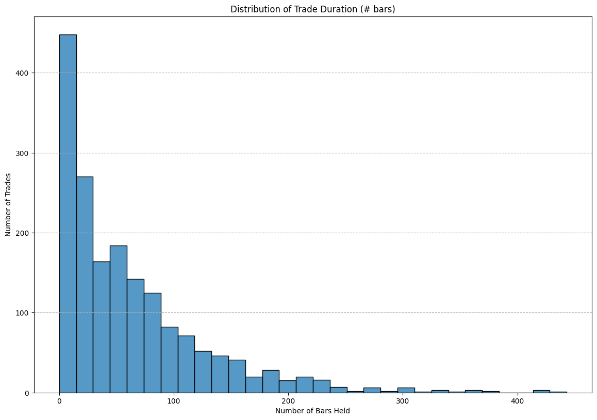

## Profit % vs. Duration Scatter Plot

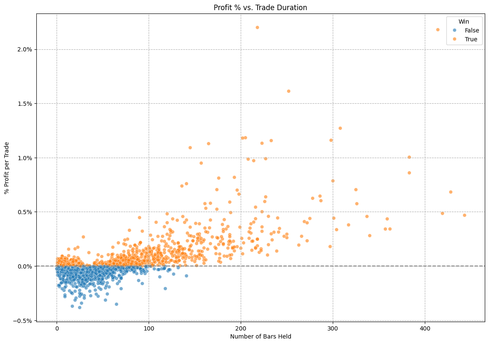

## Average Trade Duration Summary (# bars)

```text
Average bars held for Wins: 97.34
Average bars held for Losses: 32.66
```

## MAE/MFE Analysis Plot

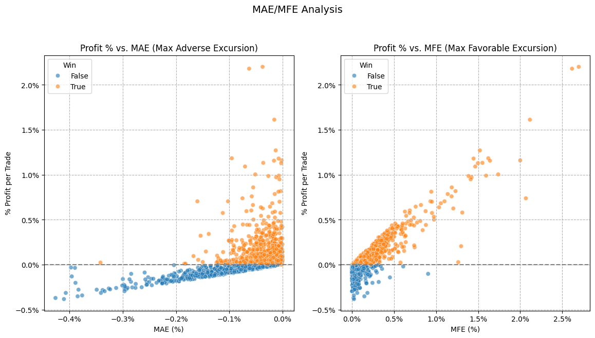

## Average MAE/MFE Summary

```text
Average MAE for Losses: -0.10%
Average MFE for Wins: 0.25%
```

## Profit Distribution Plot

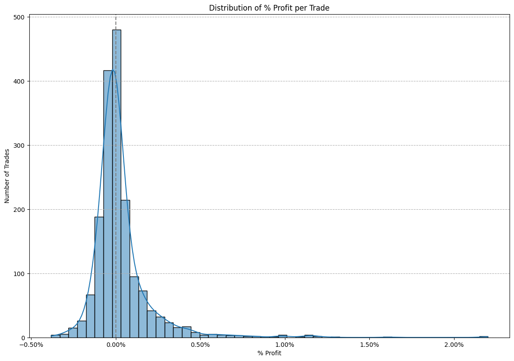

## Profit Distribution Stats (% Profit)

```text
Skewness of % Profit: 4.28
Kurtosis of % Profit: 32.15
```

## Risk Profile — R-Multiple Distribution

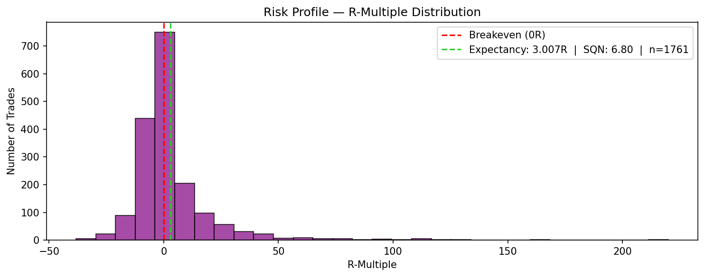

## Strategy Equity vs SPY

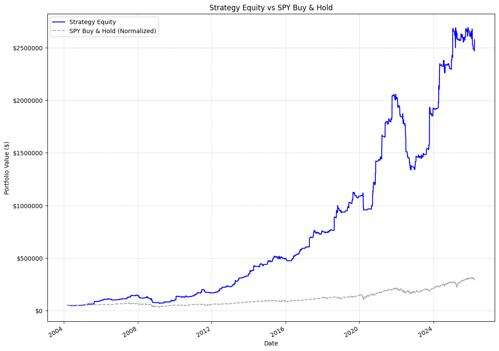

## Equity Curve and Drawdown Plot

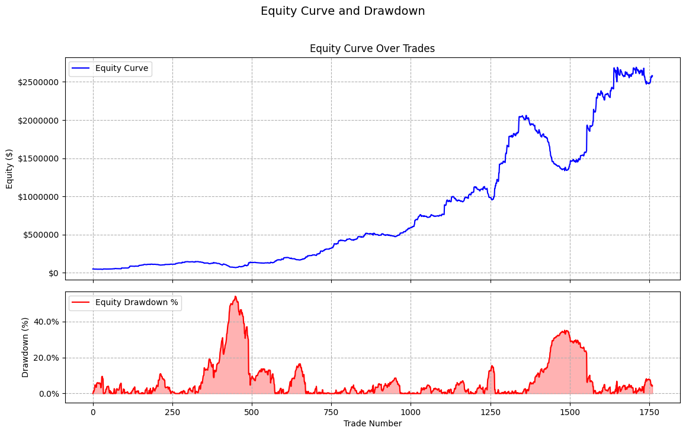

## Underwater Plot (Drawdown & Duration)

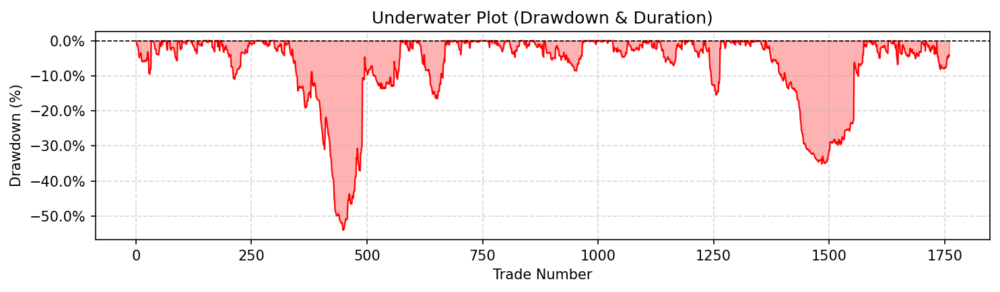

## Rolling 50-Trade Metrics

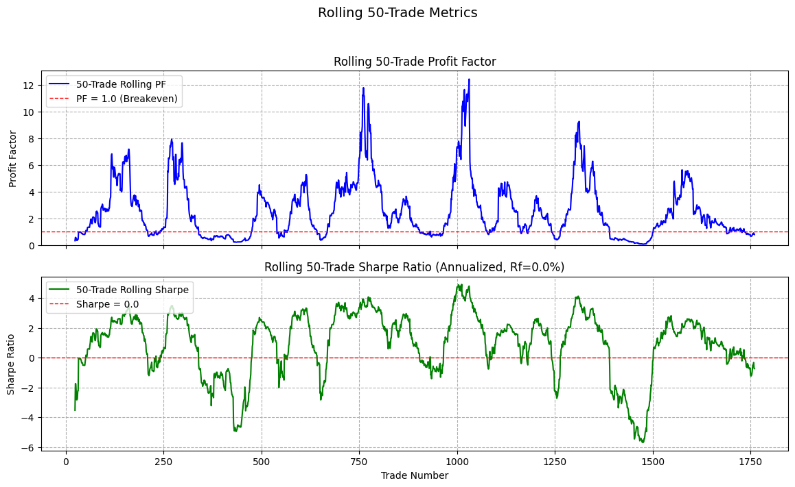

## Monte Carlo Percentile Statistics

```text
Final Equity Annual Return % Max. Drawdown $ Max. Drawdown % Lowest Eq.
1%            $0        -100.00%       $-489,370        -100.00%         $0
5%            $0        -100.00%       $-392,206        -100.00%         $0
10%           $0        -100.00%       $-343,475        -100.00%         $0
25%           $0        -100.00%       $-265,878        -100.00%         $0
50%   $1,909,952          17.99%       $-191,241         -86.10%    $11,370
75%   $2,741,821          19.94%        $-71,178         -54.11%    $39,398
90%   $3,427,505          21.16%        $-50,436         -35.65%    $49,327
95%   $3,743,412          21.65%        $-50,000         -28.49%    $50,000
99%   $4,139,385          22.20%        $-50,000         -18.91%    $50,000
```

## Monte Carlo Simulation Summary

```text
Based on 1000 simulation paths.
----------------------------------------
Final Equity:
  Average:            $1,545,754.66
  1st Percentile:     $0.00
  5th Percentile:     $0.00
  10th Percentile:    $0.00
  25th Percentile:    $0.00
  50th Percentile:    $1,909,952.41
  75th Percentile:    $2,741,820.66
  90th Percentile:    $3,427,505.17
  95th Percentile:    $3,743,411.88
  99th Percentile:    $4,139,384.75
  Probability Profit   57.70%

CAGR:
  Average:            -30.99%
  1st Percentile:     -100.00%
  5th Percentile:     -100.00%
  10th Percentile:    -100.00%
  25th Percentile:    -100.00%
  50th Percentile:    17.99%
  75th Percentile:    19.94%
  90th Percentile:    21.16%
  95th Percentile:    21.65%
  99th Percentile:    22.20%

Maximum Drawdown ($):
  Average:            $-190,127.40
  1st Percentile:     $-489,369.59
  5th Percentile:     $-392,206.20
  10th Percentile:    $-343,475.19
  25th Percentile:    $-265,878.35
  50th Percentile:    $-191,240.68
  75th Percentile:    $-71,177.59
  90th Percentile:    $-50,435.56
  95th Percentile:    $-50,000.00
  99th Percentile:    $-50,000.00

Maximum Drawdown (%):
  Average:            -76.06%
  1st Percentile:     -100.00%
  5th Percentile:     -100.00%
  10th Percentile:    -100.00%
  25th Percentile:    -100.00%
  50th Percentile:    -86.10%
  75th Percentile:    -54.11%
  90th Percentile:    -35.65%
  95th Percentile:    -28.49%
  99th Percentile:    -18.91%

Lowest Equity Reached:
  Average:            $18,825.64
  1st Percentile:     $0.00
  5th Percentile:     $0.00
  10th Percentile:    $0.00
  25th Percentile:    $0.00
  50th Percentile:    $11,369.54
  75th Percentile:    $39,397.74
  90th Percentile:    $49,327.19
  95th Percentile:    $50,000.00
  99th Percentile:    $50,000.00
```

## MC Simulated Equity Paths

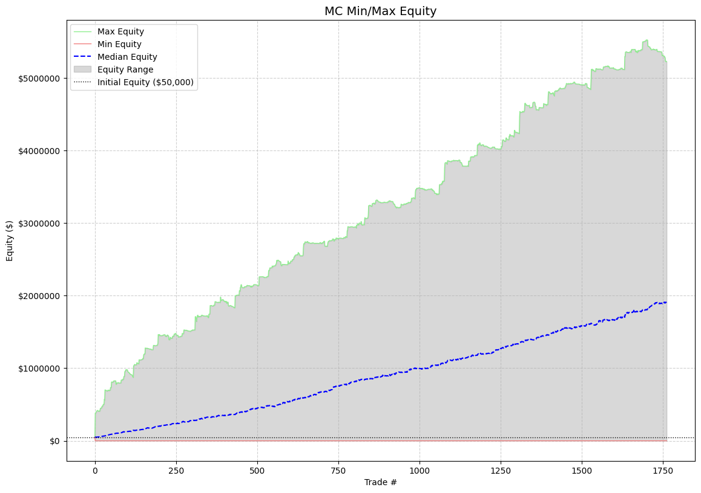

## MC Max Drawdown % Distribution

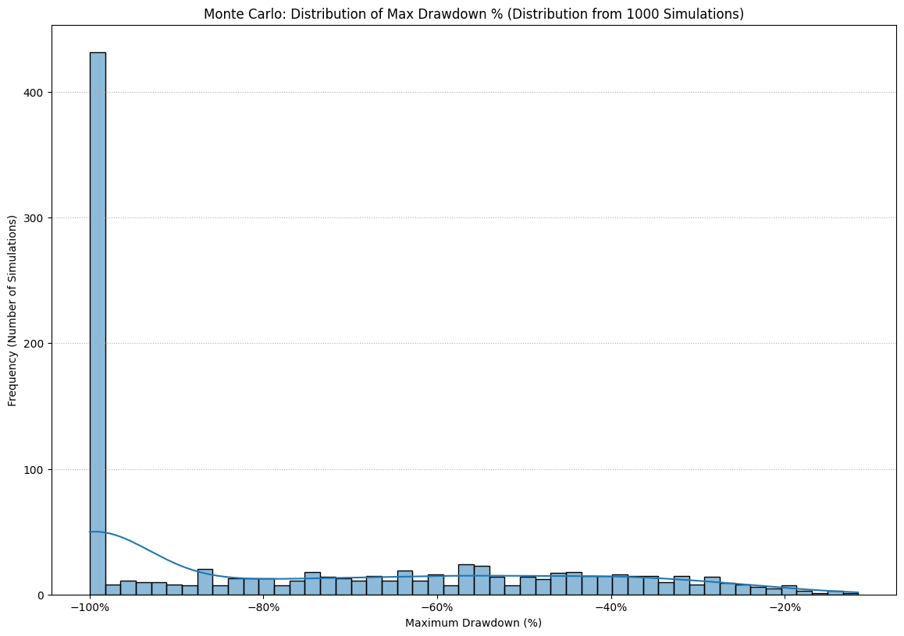

## MC Lowest Equity Distribution

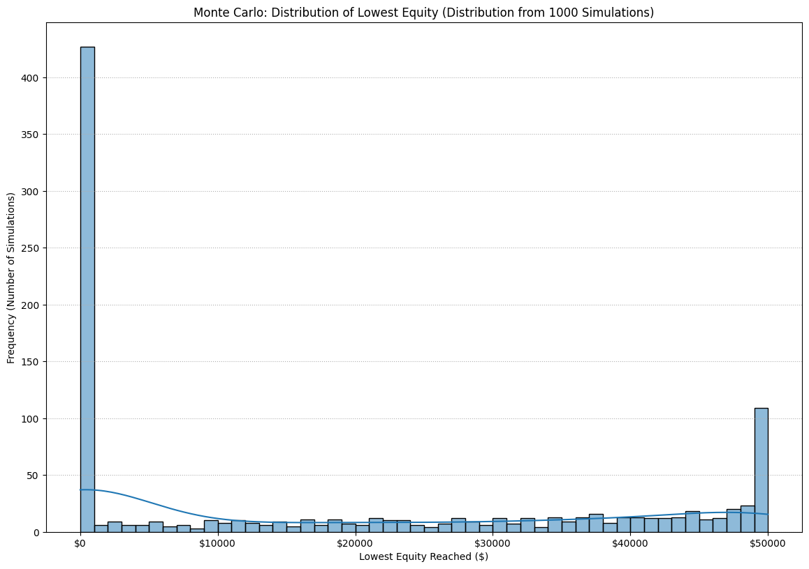

## MC Final Equity Distribution

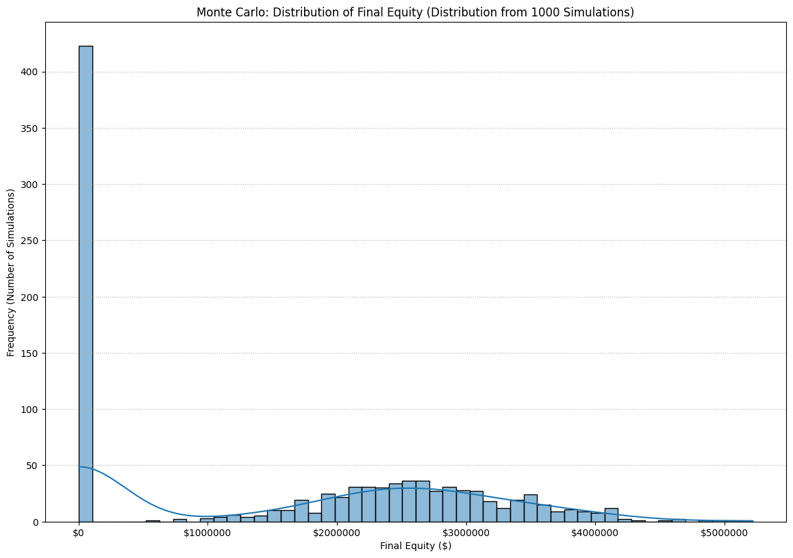

## MC CAGR Distribution

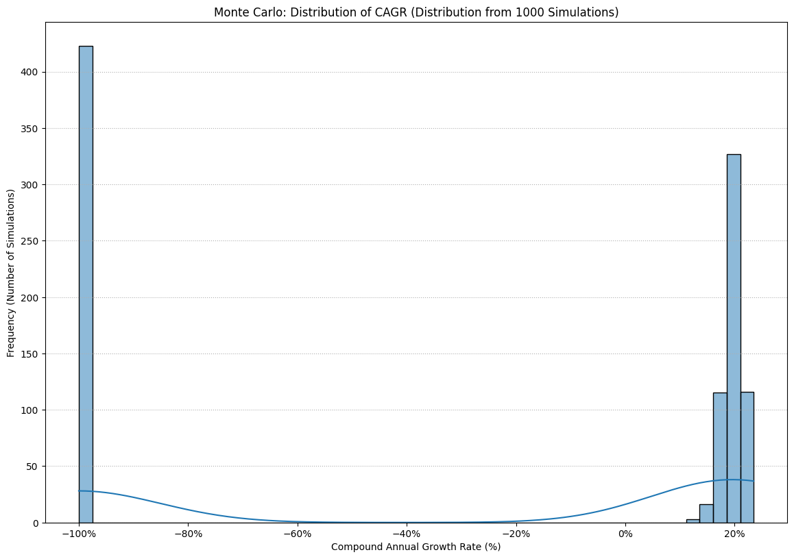