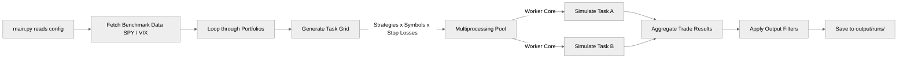

> This is the full reference documentation for July Backtester.
> For a quickstart, see the [README](../README.md).

---

## Table of Contents

1. [What This Tool Does](#what-this-tool-does)
2. [Prerequisites](#prerequisites)
3. [Installation](#installation)
4. [API Key Setup](#api-key-setup)
5. [Configuration](#configuration)
6. [Running the Backtester](#running-the-backtester)
7. [Understanding the Output](#understanding-the-output)
8. [Generating Detailed Reports](#generating-detailed-reports)
9. [Available Strategies](#available-strategies)
10. [Configuration Reference](#configuration-reference)
11. [Parameter Sensitivity Sweep](#parameter-sensitivity-sweep)
12. [Data Caching](#data-caching)
13. [Adding Custom Strategies (Plugin System)](#adding-custom-strategies-plugin-system)
14. [Project Structure](#project-structure)
15. [Contributing](#contributing)

---

## What This Tool Does

The backtester takes a strategy that you create (e.g., "buy when the 20-day SMA crosses above the 50-day SMA"), simulates it against historical price data for one or many stocks, and produces a performance report. You can run a single strategy or sweep many strategies simultaneously to find what works.

**Two modes:**

- **Single-Asset Mode** — Tests all strategies against one or a small list of specific tickers (e.g., just AAPL or BITB). Good for deep-diving a specific stock. Set `symbols_to_test` in `config.py` and run `python main.py`.
- **Portfolio Mode** — Tests strategies against an entire index or portfolio (e.g., every stock in the Nasdaq 100). Runs in parallel across all your CPU cores. This is the primary research tool. Set `portfolios` in `config.py` and run `python main.py`.

Both modes are accessed through the single entry point `main.py`. Portfolio mode is the default.

**What you get out:**

- Total P&L %, Max Drawdown, Sharpe Ratio, Calmar Ratio, Win Rate, Profit Factor
- Performance vs SPY Buy & Hold and QQQ Buy & Hold
- Monte Carlo robustness score (1,000 simulations per strategy to test if results are due to luck)
- Per-run output folder with logs, trade CSVs, and analyzer-ready files
- Optional: detailed PDF/Markdown reports via `report.py`, S3 uploads

---

## Prerequisites

Before starting, you will need:

1. **Python 3.10 or higher** — [Download here](https://www.python.org/downloads/)
2. **A Polygon.io account** — [Sign up here](https://polygon.io/). A paid plan is required for full historical data (the free tier is limited to 2 years of daily data). The Stocks Starter plan (~$29/month) covers most use cases.

**For Norgate users:** If you have a [Norgate Data](https://norgatedata.com/) subscription and the Norgate Data Updater installed locally, you can use Norgate as the data provider instead of Polygon. See [Data Provider Settings](#data-provider-settings) below.

---

## Installation

### Step 1 — Clone the Repository

```bash
git clone https://github.com/zachisit/july-backtester.git
cd july-backtester
```

### Step 2 — Create a Python Virtual Environment

A virtual environment keeps this project's dependencies isolated from your system Python. This is strongly recommended.

```bash
# Create the virtual environment
python -m venv venv

# Activate it — macOS / Linux
source venv/bin/activate

# Activate it — Windows (Command Prompt)
venv\Scripts\activate.bat

# Activate it — Windows (PowerShell)
venv\Scripts\Activate.ps1
```

You should see `(venv)` appear at the start of your terminal prompt. Every time you open a new terminal to use this tool, you need to activate the virtual environment again before running any commands.

### Step 3 — Install Dependencies

```bash
pip install -r requirements.txt
```

This installs: `pandas`, `numpy`, `tqdm`, `boto3` (S3 uploads only), `requests`, `python-dotenv`, `pandas-ta`, `orjson`, `pyarrow`.

---

## API Key Setup

The backtester reads your Polygon.io API key directly from a `.env` file or environment variable — no AWS configuration required.

1. Get your Polygon.io API key from [https://polygon.io/dashboard/api-keys](https://polygon.io/dashboard/api-keys)

2. Copy `.env.example` to `.env` in the project root:

   ```bash
   cp .env.example .env
   ```

3. Open `.env` and add your key:

   ```env
   POLYGON_API_KEY=your_key_here
   ```

4. That's it. The backtester reads `POLYGON_API_KEY` at runtime. No changes to `config.py` are needed for the default setup.

Your `.env` file is gitignored and will never be committed. If you prefer not to use a `.env` file, you can also set `POLYGON_API_KEY` as a standard system environment variable and the tool will pick it up automatically.

### (Optional) Set Up an S3 Bucket for Reports

If you want reports automatically uploaded to S3 after each run:

1. Create an S3 bucket in the AWS Console (e.g., `my-backtester-reports`) and make note of its name.
2. Ensure your environment has AWS credentials configured (via `~/.aws/credentials` or environment variables `AWS_ACCESS_KEY_ID` / `AWS_SECRET_ACCESS_KEY`).
3. Update `config.py`:

```python
"upload_to_s3": True,
"s3_reports_bucket": "my-backtester-reports",
```

S3 uploads are entirely optional. If `upload_to_s3` is `False` or `s3_reports_bucket` is empty, all output is saved locally and no AWS connection is attempted. `boto3` is only used for this S3 upload step — it is not involved in API key management.

---

## Configuration

All settings live in one file: [config.py](../config.py). Open it in any text editor before running. The file is organized into labeled sections with comments explaining each setting.

### Quick Setup Checklist

- [ ] Add `POLYGON_API_KEY` to your `.env` file (copy `.env.example` to get started)
- [ ] Set `upload_to_s3` and `s3_reports_bucket` if you want S3 uploads (optional)
- [ ] Choose `data_provider`: `"polygon"`, `"norgate"`, `"yahoo"`, or `"csv"`
- [ ] Set `start_date` and `initial_capital`
- [ ] For portfolio mode: uncomment the portfolios you want in the `portfolios` dict
- [ ] For single-asset mode: set `symbols_to_test`

### Data Provider Settings

Four data providers are supported. Set `data_provider` in `config.py`:

```python
"data_provider": "polygon",   # Polygon.io — API key via .env (default)
# "data_provider": "norgate", # Norgate Data — requires local Norgate installation
# "data_provider": "yahoo",   # Yahoo Finance via yfinance (free, no API key needed)
# "data_provider": "csv",     # Local CSV files (see CSV Data Provider section below)
```

#### Polygon.io (default)

Requires a Polygon.io account and API key set in `.env` as `POLYGON_API_KEY`. A paid plan is needed for full historical data. See [API Key Setup](#api-key-setup) above.

#### Norgate Data

Requires a [Norgate Data](https://norgatedata.com/) subscription and the Norgate Data Updater installed locally. No API key needed.

#### Yahoo Finance

Uses the [yfinance](https://pypi.org/project/yfinance/) library. **No API key or account required.** Provides free adjusted daily data for most US equities and ETFs.

```python
"data_provider": "yahoo",
```

`yfinance` is already included in `requirements.txt` — no additional setup needed. Note that Yahoo Finance data quality and availability varies; it is best suited for exploratory backtests rather than production research.

**Index ticker translation.** Polygon and Norgate use an `I:` prefix for index symbols (e.g. `I:VIX`, `$I:VIX`). Yahoo Finance uses `^` (e.g. `^VIX`). The service translates these automatically — you do not need to change anything in `config.py` or your portfolio lists. The mapping for the most common indices is:

| Norgate/Polygon symbol | Yahoo Finance symbol | Description |
| ---------------------- | -------------------- | ----------- |
| `I:VIX` / `$I:VIX` | `^VIX` | CBOE Volatility Index |
| `I:TNX` / `$I:TNX` | `^TNX` | 10-Year Treasury Yield |
| `I:TYX` / `$I:TYX` | `^TYX` | 30-Year Treasury Yield |
| `I:IRX` / `$I:IRX` | `^IRX` | 13-Week Treasury Bill |
| `I:SPX` / `$I:SPX` | `^GSPC` | S&P 500 Index |
| `I:NDX` / `$I:NDX` | `^NDX` | Nasdaq 100 Index |
| `I:DJI` / `$I:DJI` | `^DJI` | Dow Jones Industrial Average |
| `I:RUT` / `$I:RUT` | `^RUT` | Russell 2000 |

For any unmapped `I:XYZ` symbol the service falls back to `^XYZ` automatically.

#### CSV Data Provider

Reads historical OHLCV data from local CSV files. Useful for custom feeds, proprietary data, or offline use.

```python
"data_provider": "csv",
"csv_data_dir": "csv_data",   # folder containing CSV files (relative to project root)
```

**File naming:** one file per symbol, named `{SYMBOL}.csv` (case-insensitive). Example: `csv_data/AAPL.csv` or `csv_data/aapl.csv`.

**Symbols with special characters:** Windows does not allow colons or other special characters in filenames. Symbols that contain illegal characters (e.g. `I:VIX`, `$I:TNX`) have those characters replaced with underscores when constructing the filename. The mapping rule is: replace each of `\ / : * ? " < > |` with `_`. Examples:

| Symbol passed to the backtester | Expected CSV filename |
| -------------------------------- | --------------------- |
| `I:VIX` | `I_VIX.csv` |
| `I:TNX` | `I_TNX.csv` |
| `$I:VIX` | `$I_VIX.csv` |
| `AAPL` | `AAPL.csv` (unchanged) |

**Required CSV schema** (column names are case-insensitive):

| Column | Aliases accepted | Notes |
| ------ | --------------- | ----- |
| `Date` | `date`, `datetime`, `timestamp`, `time` | Any pandas-parseable date or datetime string |
| `Open` | `open` | Numeric |
| `High` | `high` | Numeric |
| `Low` | `low` | Numeric |
| `Close` | `close`, `close/last`, `adj close`, `adjusted close` | Numeric. `Adj Close` and `Close/Last` (Nasdaq format) are silently treated as `Close`. |
| `Volume` | `volume` | Numeric |

Extra columns (e.g. `VWAP`, `Turnover`) are silently ignored. The date column may be a named column or the CSV index. Multiple date formats are supported (ISO `YYYY-MM-DD`, US `MM/DD/YYYY`, datetime strings with time components, etc.).

**Nasdaq-format CSVs are natively supported.** Files downloaded directly from [nasdaq.com](https://www.nasdaq.com/market-activity/stocks/) use `Close/Last` as the price column header and prefix all price values with `$` (e.g. `$264.72`). Both are handled automatically: `Close/Last` is remapped to `Close`, and `$` signs and `,` thousands separators are stripped before numeric conversion. No pre-processing of the file is required.

**Mandatory benchmark files:** The backtester fetches four symbols at startup — before any portfolio simulation begins — to calculate SPY/QQQ buy-and-hold baselines, VIX regime filters, and TNX data used by certain strategies. These files must be present in your `csv_data_dir` regardless of which portfolio or single ticker you are testing. Missing any one of them causes an immediate fatal crash at startup.

| Required file | Symbol | Purpose |
| ------------- | ------ | ------- |
| `SPY.csv` | `SPY` | SPY buy-and-hold benchmark + regime reference |
| `QQQ.csv` | `QQQ` | QQQ buy-and-hold benchmark |
| `I_VIX.csv` | `I:VIX` | VIX regime filter (strategies that use `vix` dependency) |
| `I_TNX.csv` | `I:TNX` | 10-Year Treasury Yield (strategies that use `tnx` dependency) |

**Minimum data requirements (crucial for CSVs):** When supplying your own CSV files there are two hard limits that will cause a symbol to be silently skipped if not met.

- **250-bar minimum.** The backtester has a built-in safety check that automatically skips any symbol whose CSV contains fewer than 250 bars (roughly one calendar year of daily data). No error is raised — the symbol simply produces no results. If you notice a symbol missing from your output, a CSV that is too short is the most likely cause.

- **Indicator warm-up.** Even if a CSV passes the 250-bar check, long-lookback strategies need additional bars just to calculate their first signal. The default 50d/200d SMA Crossover strategy, for example, cannot fire a single trade until at least 200 daily bars have accumulated. A CSV that covers only a few months will pass the minimum check but still produce zero trades because the moving average never finishes warming up.

**Recommendation:** When downloading historical data from Nasdaq, Yahoo Finance, or any other source, always request **at least 3–5 years of daily bars**. This gives every default strategy enough runway to warm up its indicators and execute a meaningful number of simulated trades.

### Backtest Period

```python
"start_date": "2004-01-01",                            # How far back to test
"end_date": datetime.now().strftime('%Y-%m-%d'),        # Defaults to today
```

Setting `start_date` to a date earlier than the provider's available data is fine — the tool will use whatever the earliest available bar is.

### Capital and Position Sizing

```python
"initial_capital": 100000.0,   # Simulated account size in dollars
"allocation_per_trade": 0.10,  # 10% of equity per new position (allows up to 10 concurrent)
```

### What to Test

**Single-Asset Mode:**

```python
"symbols_to_test": ['AAPL'],                      # One ticker
"symbols_to_test": ['AAPL', 'TSLA', 'NVDA'],      # Several tickers
```

**Portfolio Mode** — edit the `portfolios` dictionary in `config.py`. Comment out entries you do not want to run:

```python
"portfolios": {
    "Nasdaq 100": "nasdaq_100.json",                      # Pre-built index list (~100 symbols)
    # "Nasdaq": "nasdaq.json",                            # Full Nasdaq (~3,000 symbols — slow)
    # "SP 500": "sp-500.json",                            # S&P 500
    "My Watchlist": ["AAPL", "MSFT", "GOOGL", "AMZN"],   # A manual list
},
```

> **Start small.** Running the full Nasdaq can take 30–60 minutes on the first run (data fetching). Use `"Nasdaq 100"` to validate your setup first.

**Norgate Watchlists:** If you use Norgate as your data provider, you can reference watchlists by name directly without creating a JSON file:

```python
"portfolios": {
    "Nasdaq Biotechnology": "norgate:Nasdaq Biotechnology",
},
```

### Stop Loss Configuration

```python
"stop_loss_configs": [
    {"type": "none"},                                   # No stop — hold until signal reverses
    # {"type": "percentage", "value": 0.05},            # 5% fixed stop below entry
    # {"type": "atr", "period": 14, "multiplier": 3.0}, # 3x ATR trailing stop
],
```

Include multiple entries to test each strategy with each stop type in the same run. Be aware that each additional stop type multiplies the total number of simulations.

### Slippage and Commission

```python
"slippage_pct": 0.0005,          # 0.05% flat slippage per fill (5 basis points)
"commission_per_share": 0.002,   # $0.002 per share commission
"max_pct_adv": 0.05,             # cap position at 5% of 20-day average daily volume
"volume_impact_coeff": 0.0,      # market impact coefficient (0.0 = disabled)
```

There are three independent cost controls:

| Control | Key | Models |
| --- | --- | --- |
| Flat slippage | `slippage_pct` | Bid/ask spread cost on every fill, regardless of size |
| Position size cap | `max_pct_adv` | Prevents unrealistically large orders by capping shares at X% of ADV — does **not** change cost |
| Market impact | `volume_impact_coeff` | Square-root price impact: `coeff x sqrt(shares / adv_20)`. Larger orders relative to ADV incur more slippage. `0.0` = disabled (default). `0.1` = mild (institutional). `0.5` = aggressive (small-cap). |

The market impact formula — a square-root model widely used in academic market microstructure — recognises that consuming 5% of ADV moves the price more than consuming 0.1% of ADV. Example at `coeff=0.1`: 1% ADV order → +1 bp impact; 5% ADV order → +2.2 bp impact.

### Output Filters

These control what appears in the printed summary table and which trade logs get saved. Setting any to `-9999` effectively disables that filter (shows everything).

```python
"mc_score_min_to_show_in_summary": 3,       # Only show strategies with MC score >= 3
"min_pandl_to_show_in_summary": 5.0,        # Only show strategies with P&L >= 5%
"max_acceptable_drawdown": 0.30,            # Only show strategies with max DD <= 30%
"min_performance_vs_spy": 0.0,              # Only show strategies that beat SPY buy-and-hold
"save_only_filtered_trades": False,         # If True, only saves trades for filtered strategies
```

---

## Running the Backtester

Make sure your virtual environment is activated (`source venv/bin/activate` or the Windows equivalent) before running.

> **First time?** Run the setup wizard before anything else:
> ```bash
> python main.py --init
> ```
> The wizard walks you through provider selection, API key setup, capital/dates, and symbol choice, then writes a ready-to-use `config_starter.py`. Rename it to `config.py` and you're ready to run.

### CLI Flags

| Flag | Description |
| --- | --- |
| *(none)* | Full backtest run |
| `--init` | Launch the first-time setup wizard |
| `--dry-run` | Validate config and print run summary without fetching data |
| `--name <label>` | Prefix the output folder with a custom label |
| `--verbose` | Print Extended Metrics and Robustness tables beneath the default Core Performance table |

### Portfolio Mode (Primary Use)

Tests all active strategies in `custom_strategies/` against all uncommented portfolios in `config.py`. Uses all CPU cores.

```bash
python main.py
```

With an optional run name (added as a prefix to the output folder):

```bash
python main.py --name "nasdaq-sma-sweep"
```

### Dry Run — Validate Without Fetching Data

Runs all startup checks (API key, config validation) and prints the run summary without fetching any market data or running simulations. Use this to confirm your configuration — portfolio sizes, strategy count, and total task estimate — before committing to a long run.

```bash
python main.py --dry-run

# Combine with --name to preview the run ID that will be used
python main.py --dry-run --name "my-next-run"
```

### Single-Asset Mode

Tests strategies against the symbols listed in `symbols_to_test` in `config.py`. Update that list first, then run the same entry point:

```bash
python main.py
```

> To use single-asset mode, set `symbols_to_test` in `config.py` and make sure the `portfolios` dict only contains the symbols you want (or wrap them as a portfolio entry like `"My Tickers": ["AAPL", "TSLA"]`).

### First Run Tips

1. **Validate with one symbol first.** Set `"portfolios": {"Test": ["SPY", "QQQ"]}` and confirm the run completes without errors before testing larger lists.
2. **Watch for API key errors.** If you see `Could not find 'POLYGON_API_KEY'` in the terminal, your `.env` file is missing or the variable name doesn't match.
3. **The first run is the slowest.** Data is fetched from Polygon and cached locally. Subsequent runs within 24 hours load from disk and are much faster.

---

## Understanding the Output

### Run Output Folder

Every backtest creates a timestamped folder under `output/runs/`:

```text
output/
└── runs/
    └── <run_id>/                        # e.g. 2026-03-02_15-12-32 or myname_2026-03-02_15-12-32
        ├── logs/                        # Execution log: run_<timestamp>.log
        ├── raw_trades/                  # Per-portfolio raw trade CSVs (when save_individual_trades=True)
        │   └── <Portfolio_Name>/
        ├── analyzer_csvs/               # Renamed + column-mapped CSVs ready for report.py
        │   └── <Portfolio_Name>/
        ├── detailed_reports/            # PDFs / Markdown generated by report.py
        ├── config_snapshot.json         # Copy of config.py settings used for this run
        ├── overall_portfolio_summary.csv
        └── ml_features.parquet          # ML-ready trade export (when export_ml_features=True)
```

The entire `output/` directory is gitignored. Each run is isolated in its own folder — previous runs are never overwritten. S3 uploads (if configured) mirror this same `<run_id>/` structure as the key prefix.

### Run Summary Box

At startup, the backtester prints a summary box to the log / terminal before fetching any data:

```text
============================================================
  RUN SUMMARY
============================================================
  Run ID            : 2026-03-10_14-22-01
  Data provider     : yahoo
  Period Selected   : 2004-01-01 -> 2026-03-10
  Timeframe         : D x 1
  Strategies        : 22
  Stop configs      : 1
------------------------------------------------------------
  Portfolio         : Nasdaq 100 (101 symbols)
------------------------------------------------------------
  Total symbols     : 101
  Total tasks       : 2222  (symbols x strategies x stop configs)
============================================================
```

After benchmark data (SPY) has been fetched, a second line is logged:

```text
  Actual Data Period : 2004-01-02 -> 2026-03-07  (via SPY)
```

**Period Selected** is exactly what you configured in `config.py`. **Actual Data Period** is the real date range returned by the data provider for SPY — this is the ground truth for how far back your strategy results are calculated. The two values differ whenever:

- The data provider does not have data going back to your requested `start_date` (e.g. free-tier API limits, or a ticker that was listed later)
- The `end_date` falls on a weekend or holiday, so the last available bar is a trading day before it

### Terminal Summary Tables

After each portfolio finishes, a **Core Performance** table is printed to the terminal:

```text
--- Core Performance: Nasdaq 100 ---
---------------------------------------------------------------------------------------------
Strategy                   P&L (%)   vs. SPY (B&H)   Sharpe   Max DD   MC Score   WFA Verdict
---------------------------------------------------------------------------------------------
SMA Crossover (20d/50d)    18.70%    +4.30%          1.41     11.20%   78         Pass
SMA Crossover (50d/200d)   9.40%     -5.20%          0.98     8.80%    55         Fail
---------------------------------------------------------------------------------------------

  Run with --verbose for extended metrics and robustness scores.
```

Run with `--verbose` to print two additional tables beneath it:

```bash
python main.py --verbose
```

**Core Performance** — always printed:

| Column | Description |
| --- | --- |
| Strategy | Strategy name (with variant suffix if sensitivity sweep is on) |
| P&L (%) | Total return over the backtest period |
| vs. SPY (B&H) | Outperformance vs SPY buy-and-hold |
| Sharpe | Annualised Sharpe ratio (risk-free rate subtracted) |
| Max DD | Maximum peak-to-trough drawdown |
| MC Score | Monte Carlo robustness score (-999 to 100) |
| WFA Verdict | Walk-Forward Analysis result (Pass / Fail / N/A) |

**Extended Metrics** — printed with `--verbose`:

| Column | Description |
| --- | --- |
| vs. QQQ | Outperformance vs QQQ buy-and-hold |
| Calmar | Annualised return divided by max drawdown (higher = better) |
| RS(avg) | Mean of all 126-day rolling Sharpe windows — regime-averaged quality |
| RS(min) | Worst 126-day rolling Sharpe — reveals prolonged losing streaks |
| RS(last) | Most recent 126-day rolling Sharpe — current momentum signal |
| MaxRcvry | Longest calendar days from drawdown trough to new equity peak. `N/A` if curve ends in open drawdown. |
| AvgRcvry | Mean recovery time across all completed drawdowns. `N/A` if curve ends in open drawdown. |
| PF | Profit Factor (gross profit / gross loss) |
| WinRate | Percentage of trades that were profitable |
| Trades | Total number of completed trades |
| Expct(R) | Expectancy in R-multiples — average R earned per trade risked |
| SQN | System Quality Number — `(Expectancy / StdDev(R)) × sqrt(N)`. 2.5+ = Good, 3.0+ = Excellent. |

**Robustness** — printed with `--verbose`:

| Column | Description |
| --- | --- |
| OOS P&L | Out-of-sample P&L from Walk-Forward Analysis |
| WFA Verdict | Single-split WFA result (Pass / Fail / N/A) |
| RollWFA | Rolling k-fold WFA verdict — `Pass (K/N)`, `Fail (K/N)`, or `N/A`. Requires `wfa_folds` to be set. |
| Corr | Average pairwise correlation with other strategies in the portfolio |
| MC | Monte Carlo verdict (Robust / High Tail Risk / etc.) |
| MC Score | Numeric MC robustness score (see Monte Carlo Score Explained below) |

> **Note:** `VolumeImpact_bps` (total market impact cost in basis points) only appears in trade CSVs when `volume_impact_coeff > 0` — it is not shown in any terminal table.

### Core Metrics Glossary

A quick-reference for the key derived metrics produced by the engine. Detailed explanations follow in the sections below.

| Metric | Definition | Why it's useful |
| --- | --- | --- |
| **Expectancy (R)** | Average R-Multiple per trade. | Answers: "On average, how many units of risk do I earn per trade?" |
| **SQN** | System Quality Number — `(Expectancy / StdDev(R)) x sqrt(N)`. | A score from Van Tharp measuring system quality; 2.5+ is Good, 3.0+ is Excellent. |
| **Annual Turnover** | `(sum(entry_price x shares) / initial_capital) / years x 100`. | Measures how many times the full portfolio is recycled per year. |
| **After-Tax CAGR** | CAGR calculated after a flat 30% tax haircut on net profits. | Provides a realistic "take-home" performance comparison against gross benchmarks. |

### Additional Metrics in the PDF Report

The **Overall Performance Metrics** page of the PDF tearsheet includes two additional derived metrics not shown in the terminal table:

- **Annual Turnover %** — `(sum(entry_price x shares) / initial_capital) / years x 100`. Measures how many times the full portfolio is recycled per year. A turnover of 200% means the equivalent of the entire account was deployed twice over. Requires `Price` and `Shares` columns in the trade data; shows `N/A` otherwise.

- **Estimated After-Tax CAGR (30% tax)** — applies a flat 30% short-term capital gains rate to any net profit before computing CAGR. Formula: `after_tax_equity = initial_capital + max(net_profit, 0) x 0.70 + min(net_profit, 0)`. Losses are carried through unchanged (no tax benefit assumed). Placed directly below the standard CAGR line for easy comparison.

### Monte Carlo Score Explained

Every strategy with 50+ trades is stress-tested with 1,000 simulations that randomly reshuffle the historical trade sequence. This reveals whether results depend on lucky ordering or are genuinely robust.

**Sampling methods** (controlled by `mc_sampling` in config):

| Method | Config value | Description |
| --- | --- | --- |
| i.i.d. (default) | `"iid"` | Each trade is resampled independently. Fast and statistically standard. Assumes no autocorrelation between trades. |
| Block-bootstrap | `"block"` | Consecutive *blocks* of trades are sampled as a unit, preserving win/loss streaks and regime clustering. Recommended when the Regime Heatmap shows the strategy only loses in one VIX bucket. Auto block size = `floor(sqrt(N))` (Politis-Romano rule of thumb). |

| Score | Verdict | What It Means |
| --- | --- | --- |
| 5 | Robust | Consistent across simulations. Results are likely genuine. |
| 3–4 | Good | Solid with minor concerns. Worth investigating further. |
| 1–2 | Moderate | Some robustness concerns. Proceed with caution. |
| <= 0 | Weak / Perf. Outlier | Results may be overfitted or luck-dependent. |

**Warning flags in MC Verdict:**

- `Perf. Outlier` — The historical return was worse than 95% of simulations, meaning the actual results are *below* what random sampling would expect. Investigate why.
- `DD Understated` — Historical drawdowns were better than median simulations. The backtest period may have been unusually favorable.
- `Moderate Tail Risk` — Worst-case simulations show 50–80% drawdown potential.
- `High Tail Risk` — Worst-case simulations show >80% drawdown potential. High risk of ruin.

### Walk-Forward Analysis (WFA)

> [!IMPORTANT]
> **Why WFA?** A strategy optimised on the same data it's being measured on is like studying the answer key before a test — it will look great, but fail in the real world. WFA holds back the most recent slice of data during strategy development, then checks if the edge still holds on that unseen period. A strategy that passes both IS and OOS is far more likely to be genuinely robust.

Every strategy result includes two WFA columns alongside the Monte Carlo output:

| Column | Meaning |
| --- | --- |
| OOS P&L (%) | Total P&L earned in the Out-of-Sample window as a percentage of initial capital |
| WFA Verdict | Pass / Likely Overfitted / N/A |

**How the split works:** The backtester uses the actual data period (as reported by SPY) — not the configured `start_date` — to compute the IS/OOS boundary. With the default `wfa_split_ratio: 0.80`, the first 80% of that period is In-Sample (IS) and the final 20% is Out-of-Sample (OOS). A strategy tested over 20 years of data would have 16 years of IS history and 4 years of OOS history.

**Verdict logic:**

- **Pass** — OOS performance does not show signs of overfitting.
- **Likely Overfitted** — Either the IS period is profitable but the OOS period is a net loss (sign flip), *or* the OOS annualised return has degraded by more than 75% relative to the IS annualised return.
- **N/A** — WFA is disabled (`wfa_split_ratio` is `None` or `0`), or the OOS window contains fewer than 5 completed trades (insufficient data for a meaningful verdict).

**Disabling WFA:** Set `"wfa_split_ratio": None` (or `0`) in `config.py`. Both `OOS P&L (%)` and `WFA Verdict` will show `N/A` for all strategies.

#### Rolling Multi-Fold WFA (opt-in)

For a more rigorous overfitting check, enable rolling k-fold WFA by setting `wfa_folds` to an integer >= 2 in `config.py`. This is independent of `wfa_split_ratio` — both can be active simultaneously.

```python
"wfa_folds": 5,           # divide the period into 5 equal OOS windows
"wfa_min_fold_trades": 5, # skip folds with fewer than 5 OOS trades
```

**How it works:** The full period is split into *k* equal-width windows. For fold *i*, the IS window is everything before that fold's start date and the OOS window is the fold itself. Each fold is scored independently using the same `Pass / Likely Overfitted` logic as the single-split WFA. A fold with fewer than `wfa_min_fold_trades` OOS trades is skipped (not counted).

**`Rolling WFA` column verdict:**

| Verdict | Meaning |
| --- | --- |
| `Pass (K/N)` | >= 60% of scorable folds pass individually (K = passing folds, N = total scorable folds) |
| `Fail (K/N)` | < 60% of scorable folds pass |
| `N/A` | Fewer than 2 folds had enough trades to score, or `wfa_folds` is not set |

### R-Multiple, Expectancy, and SQN

> [!TIP]
> **Why SQN?** While P&L tells you how much you made, SQN tells you how much you can actually *trust* your strategy's consistency. It penalises volatile strategies and rewards consistent ones — a system earning 1R every trade scores higher than one that randomly earns 10R then loses 8R. Meanwhile, Expectancy answers the simpler question: "On average, how many units of risk do I earn per trade?" A strategy with 40% win rate but an average winner of 3R and average loser of -1R is far superior to a 60% winner that earns only 0.5R per win.

**How R-Multiple is calculated:**

1. **Initial Risk (per share)** — captured at trade entry: `entry_price - initial_stop_loss_price`
   - If no stop loss is configured, a **1% proxy** is used: `entry_price x 0.01`
   - The initial stop is frozen at entry; trailing-stop updates do not affect it.
2. **R-Multiple** — calculated at trade close: `net_pnl / (initial_risk_per_share x shares)`
   - A trade that earns exactly 1x the amount risked = `1R`
   - A trade that loses the full stop = `-1R`
   - Both `InitialRisk` and `RMultiple` are written to every row of the trade CSV.

**Expectancy (Avg. R per trade):**

`Expectancy = mean(all R-Multiples)`

This answers: *"On average, how many R do I earn per trade?"* Positive is good. A value above `0.5R` is generally considered a solid edge.

**SQN (System Quality Number):**

`SQN = (Expectancy / StdDev(R-Multiples)) x sqrt(N)`

Developed by Van Tharp. It normalises expectancy by the consistency of the R distribution and scales with sample size. Rule of thumb:

| SQN | Quality |
| --- | --- |
| < 1.6 | Poor — not tradeable |
| 1.6 – 1.9 | Below average |
| 2.0 – 2.4 | Average |
| 2.5 – 2.9 | Good |
| 3.0 – 5.0 | Excellent |
| > 5.0 | Holy Grail (verify for overfitting) |

Both `Expectancy (R)` and `SQN` show `N/A` for strategies with fewer than 2 completed trades.

**PDF report:** when a strategy CSV contains an `RMultiple` column, the detailed report includes a purple histogram of the full R distribution with a red breakeven line (0R) and a green expectancy line annotated with Expectancy, SQN, and trade count.

### Price Noise Injection (Stress Testing)

> [!IMPORTANT]
> **Why stress test?** A strategy that only works on perfectly clean historical prices is brittle. Real-world data contains bid/ask spread noise, stale quotes, and data-vendor rounding errors. Injecting a small amount of random noise before running the backtest reveals whether your edge survives minor perturbations — a robust strategy should still pass WFA and Monte Carlo checks even with +/-1-2% noise applied per bar.

Enable noise injection in `config.py`:

```python
"noise_injection_pct": 0.01,  # +/-1% uniform noise per OHLC cell per bar
```

**How it works:**

For each bar and each of Open, High, Low, and Close, an independent multiplier drawn from `Uniform(1 - noise_pct, 1 + noise_pct)` is applied. After perturbation, **High and Low are reconstructed** as the row-wise maximum and minimum across all four price columns — this guarantees that no candlestick becomes invalid (`High < Low` or price order violations). Volume and the date index are never touched.

**Terminal warning when enabled:**

```text
************************************************************
  [STRESS TEST MODE] Injecting 1.0% random noise into OHLC price data
  High/Low bounds are enforced after noise — no invalid candlesticks
************************************************************
```

**Typical usage:**

| `noise_injection_pct` | Meaning |
| --- | --- |
| `0.0` (default) | Disabled — clean historical prices used |
| `0.005` | +/-0.5% noise — very mild perturbation |
| `0.01` | +/-1% noise — recommended starting point for robustness checks |
| `0.02` | +/-2% noise — aggressive; strategies with thin edges will fail |

**What to look for:** If a strategy's WFA verdict flips from `Pass` -> `Likely Overfitted` with noise enabled, it was curve-fitted to specific price levels. Discard it or widen entry/exit conditions.

### Strategy Correlation Matrix

> [!TIP]
> **Why check correlation?** Running two highly correlated strategies is effectively doubling your position in a single edge — they will win and lose together, offering no diversification benefit. The correlation analysis automatically surfaces these overlaps after every portfolio run so you can prune redundant strategies before live trading.

After each portfolio finishes, the backtester computes pairwise Pearson correlations between all strategies based on their daily realised P&L. The result is saved as a CSV, an `Avg. Corr` column appears in the terminal summary table, and any pairs above the threshold trigger a prominent alert.

**How it works:** Each strategy's trade log is aggregated into a daily P&L series (trades grouped by exit date, profits summed). These series are aligned into a date x strategy matrix, with missing dates filled with 0. Pearson correlations are then computed on that combined matrix.

**Output file location:**

```text
output/runs/<run_id>/<Portfolio_Name>_strategy_correlation.csv
```

For example: `output/runs/2026-03-10_14-22-01/Nasdaq_100_strategy_correlation.csv`

The CSV has strategy names as both row index and column headers, values rounded to 4 decimal places.

**`Avg. Corr` column in the summary table:**

Each strategy shows its mean absolute Pearson correlation against all other strategies in the run. Strategies with any pairwise correlation above the threshold are flagged with `*` (e.g. `0.81*`).

**How to Interpret:**

| Range | Meaning | Action |
| --- | --- | --- |
| **0.70 - 1.00** | **High Overlap (Red Flag)** | Strategies enter/exit at nearly the same times. Remove one unless they differ in risk/sizing. |
| **0.30 - 0.70** | **Moderate Overlap** | Some shared signal; acceptable if each strategy has independent edge. |
| **0.00 - 0.30** | **High Diversification (Goal)** | Strategies behave independently -- ideal portfolio composition. |

**Terminal alert example:**

```text
!!!!!!!!!!!!!!!!!!!!!!!!!!!!!!!!!!!!!!!!!!!!!!!!!!!!!!!!!!!!!!!!!!!!!!!!
  HIGH CORRELATION ALERT  |  Portfolio: Nasdaq 100
  Threshold: |r| > 0.70 -- strategies below may overlap significantly
!!!!!!!!!!!!!!!!!!!!!!!!!!!!!!!!!!!!!!!!!!!!!!!!!!!!!!!!!!!!!!!!!!!!!!!!
    'SMA Crossover (20d/50d)' <-> 'EMA Crossover (Unfiltered)'  r=+0.91  [HIGH OVERLAP -- consider removing one]
!!!!!!!!!!!!!!!!!!!!!!!!!!!!!!!!!!!!!!!!!!!!!!!!!!!!!!!!!!!!!!!!!!!!!!!!
```

The default threshold is **0.70** (absolute value). Pairs with `|r| > 0.70` are flagged as `HIGH CORRELATION ALERT` warnings.

**When the matrix is not generated:** If fewer than 2 strategies have completed trades in a portfolio, correlation analysis is silently skipped and no CSV is written.

## Parameter Sensitivity Sweep

> [!IMPORTANT]
> **Why sweep parameters?** Backtests are vulnerable to p-hacking — an intern (or an experienced analyst) who tweaks a single parameter until the equity curve looks great has almost certainly overfit to historical noise. The sensitivity sweep automatically varies every numeric param in a strategy's definition across a grid and reports what fraction of variants are profitable. A genuine edge survives parameter perturbations; a curve-fitted edge does not.

Enable in `config.py`:

```python
"sensitivity_sweep_enabled": True,
"sensitivity_sweep_pct": 0.20,    # +/-20% per step
"sensitivity_sweep_steps": 2,     # 2 steps each side -> 5 values per param
"sensitivity_sweep_min_val": 2,   # floor (prevents e.g. SMA period = 0)
```

**How it works:**

For a strategy registered with `params={"fast": 20, "slow": 50}`, the sweep generates values:

- `fast`: `[12, 16, 20, 24, 28]` (5 values at +/-20% steps)
- `slow`: `[30, 40, 50, 60, 70]` (5 values at +/-20% steps)

This produces a **25-point cartesian grid** (5 x 5). Each grid point runs as an independent simulation — they appear as separate rows in all summary tables. Non-numeric params (strings, bools) are carried through unchanged in every variant.

**Strategy naming in results:**

| Strategy name in output | Meaning |
| --- | --- |
| `SMA Crossover (20d/50d) [(base)]` | Base parameter values |
| `SMA Crossover (20d/50d) [fast=16]` | Only `fast` changed from base |
| `SMA Crossover (20d/50d) [fast=16 slow=40]` | Both params changed |

**Sensitivity report (printed after the run):**

```text
======================================================================
  PARAMETER SENSITIVITY REPORT
======================================================================

  SMA Crossover (20d/50d)
  Robust — profitable in 72% of variants (18/25)

  Variant                             P&L    Sharpe   Max DD   MC Score
  ----------------------------------------------------------------------
  (base)                            14.2%      1.42   18.3%        72 <-- base
  fast=16                           12.8%      1.31   19.1%        65
  fast=24                           11.4%      1.19   20.5%        58
  fast=16 slow=40                    9.7%      1.08   22.3%        51
  fast=12 slow=30                    2.1%      0.21   31.4%        12
  fast=28 slow=70                   -3.4%      0.00   38.2%        -8
  ...
======================================================================
```

**Fragility verdict thresholds:**

| % of variants profitable | Verdict |
| --- | --- |
| >= 30% | `Robust — profitable in X% of variants (Y/Z)` |
| < 30% | `*** FRAGILE — profitable in only X% of variants ***` |

**Performance note:** With 2 numeric params and `steps=2`, the sweep creates 25x more tasks. With 3 params it's 125x. Keep `sensitivity_sweep_enabled: False` for normal runs; enable only for targeted fragility checks on candidate strategies.

**No-regression guarantee:** When `sensitivity_sweep_enabled: False` (default), the task-building loop is identical to pre-sweep behaviour — `param_variants = [base_params]`, one task per strategy.

---

### Local Report Files

| Location | Contents |
| --- | --- |
| `output/runs/<run_id>/overall_portfolio_summary.csv` | All results across all portfolios, sorted by MC Score. The first 5 columns are run metadata (`run_id`, `data_provider`, `start_date`, `end_date`, `timeframe`) so results are self-describing when combined across runs. |
| `output/runs/<run_id>/<Portfolio>_strategy_correlation.csv` | Pearson correlation matrix of daily P&L across all strategies for that portfolio |
| `output/runs/<run_id>/analyzer_csvs/<Portfolio>/` | Column-mapped CSVs ready to pass into `report.py` |
| `output/runs/<run_id>/raw_trades/<Portfolio>/` | Per-symbol, per-strategy raw trade logs (when `save_individual_trades=True`) |
| `output/runs/<run_id>/logs/` | Full execution log for the run |
| `output/runs/<run_id>/ml_features.parquet` | ML-ready consolidated trade feature file (when `export_ml_features=True`) |

### ML Feature Export

Enable in `config.py`:

```python
"export_ml_features": True,   # requires: pip install pyarrow
```

After the run, `ml_features.parquet` will contain one row per completed trade across all strategies and portfolios, with the following schema:

| Column | Type | ML Role |
| --- | --- | --- |
| `Strategy`, `Portfolio`, `Symbol` | str | grouping keys |
| `EntryDate`, `ExitDate` | Timestamp | temporal features |
| `HoldDuration` | int | hold-period feature |
| `EntryPrice`, `ExitPrice`, `Profit`, `ProfitPct`, `Shares` | float | trade economics |
| **`is_win`** | **int8** | **classification target (1 = profit, 0 = loss)** |
| `RMultiple`, `MAE_pct`, `MFE_pct` | float | risk/reward features |
| `ExitReason`, `InitialRisk` | str/float | context features |
| `entry_RSI_14`, `entry_ATR_14_pct`, `entry_SMA200_dist_pct`, `entry_Volume_Spike` | float | price-action features at entry |
| `entry_SPY_RSI_14`, `entry_SPY_SMA200_dist_pct` | float | market regime features |
| `entry_VIX_Close`, `entry_TNX_Close` | float | macro features |

The internal `Trade` counter column is excluded. If `pyarrow` is not installed, a `.csv` fallback is written automatically.

### S3 Reports (if configured)

All output files are also uploaded to `s3://<your-bucket>/<run_id>/`. Each run uses its timestamped folder as the S3 key prefix, so previous results are never overwritten.

---

## Generating Detailed Reports

After a run completes, you can generate a detailed PDF or Markdown report for any individual strategy using `report.py`. This produces equity curves, drawdown charts, trade distribution analysis, and more.

The PDF tearsheet includes an **Underwater Plot** positioned immediately below the equity curve — a short, wide red-filled chart that visualises both the depth and duration of every drawdown period throughout the backtest.

### Single-File Usage

```bash
python report.py output/runs/<run_id>/analyzer_csvs/<Portfolio>/<Strategy>.csv
```

The report is automatically saved to `output/runs/<run_id>/detailed_reports/`. No `--output-dir` flag is needed when working with files inside a run folder.

### Batch Mode — Generate All Reports for a Run

To generate reports for every strategy in a run at once, pass the run directory with `--all`:

```bash
python report.py --all output/runs/<run_id>
```

This finds every `.csv` file recursively under `<run_id>/analyzer_csvs/` and generates one report per file. All reports are saved to `<run_id>/detailed_reports/`. A summary line is printed when complete:

```text
Generated 14 reports in output/runs/2026-03-02_15-12-32/detailed_reports
```

### Examples

```bash
# Generate a report for a specific strategy from your last run
python report.py output/runs/2026-03-02_15-12-32/analyzer_csvs/Nasdaq_100/SMA_Crossover_20d_50d.csv

# Generate a report from a named run
python report.py output/runs/nasdaq-sweep_2026-03-02_15-12-32/analyzer_csvs/Nasdaq_100/SMA_Crossover_20d_50d.csv

# Generate all reports for an entire run at once
python report.py --all output/runs/2026-03-02_15-12-32

# Override where the report is saved
python report.py path/to/strategy.csv --output-dir /path/to/custom/folder

# Set a custom name for the report file and folder
python report.py path/to/strategy.csv --report-name "my-strategy-deep-dive"

# Override the initial equity used for equity curve calculations
python report.py path/to/strategy.csv --equity 250000
```

### All report.py Options

| Flag | Default | Description |
| --- | --- | --- |
| `csv_path` | (required, or use `--all`) | Path to a single backtester-generated CSV |
| `--all RUN_DIR` | — | Path to a run directory; generates reports for all CSVs under `analyzer_csvs/` |
| `--output-dir` | Auto-detected | Root directory for report output. Auto-detected when the CSV is inside `analyzer_csvs/`. |
| `--equity` | 100000 | Initial equity for equity curve calculations |
| `--report-name` | CSV filename | Custom name for the generated report file and its parent folder (single-file mode only) |

> `csv_path` and `--all` are mutually exclusive — use one or the other.

---

## Available Strategies

Strategies are loaded automatically from the `custom_strategies/` plugin directory.
No file outside that directory needs to be edited to add, remove, or rename a strategy.

### Currently Active (plugin files)

| Plugin file | Registration name | Description |
| --- | --- | --- |
| `sma_crossovers.py` | SMA Crossover (20d/50d) | Buy when 20-bar SMA crosses above 50-bar SMA |
| `sma_crossovers.py` | SMA Crossover (50d/200d) | Classic "golden cross" — 50-bar SMA crosses above 200-bar SMA |

### Quick-Scan Strategy Matrix

New to the library? Use this table to find a starting point based on your experience level. Then see the full catalogue below for parameters and dependencies.

| Category | Example Plugins | Risk / Complexity |
| --- | --- | --- |
| **Trend Following** | SMA Crossover (50/200), MACD Crossover, Donchian Breakout | Low |
| **Mean Reversion** | RSI (14/30), Bollinger Band Fade, Stochastic, CMF | Medium |
| **Volatility / Breakout** | BB Squeeze, Keltner Breakout, ATR Trailing Stop | High |
| **Scalping (Sub-Daily)** | 1m EMA Scalp, 1m RSI Extreme Fade, 1m BB Squeeze | Very High |
| **Calendar / Regime** | Weekend Hold, Hold the Week, Daily Overnight Hold | Low |

### Strategy Library — Full Plugin Catalogue

All strategies below are pre-built in `custom_strategies/` and inactive by default.
To activate any strategy, simply copy the relevant `.py` file into `custom_strategies/`
(if not already present) — the engine discovers it automatically on the next run.
Individual strategies within a file can be commented out by removing or wrapping
their `@register_strategy` decorator.

#### RSI Strategies (`custom_strategies/rsi_strategies.py`)

| Registration name | Key params | Description |
| --- | --- | --- |
| `RSI Mean Reversion (14/30)` | length=14d, oversold=30, exit=50 | Buy when RSI crosses back above 30; exit above 50 |
| `RSI Mean Reversion (7/20)` | length=7d, oversold=20, exit=50 | Aggressive short-period RSI with tight oversold threshold |
| `RSI (14d) w/ SMA200 Filter` | rsi=14d, sma=200d | RSI mean reversion, only taken when price is above 200-bar SMA |
| `1m RSI Extreme Fade (14/20/80)` | rsi=14min, levels=20/80 | Sub-daily extreme RSI fade; requires `timeframe = "MIN"` |

#### MACD & EMA Strategies (`custom_strategies/macd_strategies.py`)

| Registration name | Key params | Dependencies | Description |
| --- | --- | --- | --- |
| `MACD Crossover (12/26/9)` | fast=12d, slow=26d, signal=9d | — | Buy when MACD line crosses above signal line |
| `MACD+RSI Confirmation` | macd=12/26/9d, rsi=14d | — | MACD crossover gated by RSI > 50 |
| `EMA Crossover (Unfiltered)` | fast=20d, slow=50d | — | Pure EMA crossover, no regime filter |
| `EMA Crossover w/ SPY-Only Filter` | fast=20d, slow=50d | `spy` | EMA crossover, buys gated by SPY above 200-bar SMA |
| `EMA Crossover w/ VIX-Only Filter` | fast=20d, slow=50d | `vix` | EMA crossover, buys gated by VIX below 30 |
| `EMA Crossover w/ SPY+VIX Filter` | fast=20d, slow=50d | `spy`, `vix` | EMA crossover, full "Bull-Quiet" regime filter |
| `1m EMA Scalp (5/15/50)` | emas=5/15/50min | — | Sub-daily EMA scalp; requires `timeframe = "MIN"` |

#### Mean Reversion & Other Strategies (`custom_strategies/mean_reversion.py`)

| Registration name | Key params | Dependencies | Description |
| --- | --- | --- | --- |
| `Bollinger Band Fade (20d/2.0)` | length=20d, std=2.0 | — | Buy below lower band; exit at middle SMA |
| `Bollinger Band Fade (20d/2.5)` | length=20d, std=2.5 | — | Wider-band fade; fewer but more extreme entries |
| `Bollinger Band Breakout (20d)` | length=20d, std=2 | — | Buy above upper band; momentum breakout direction |
| `Bollinger Band Squeeze (20d/40d)` | length=20d, squeeze=40d | — | Enter breakout after low-volatility squeeze period |
| `Bollinger Band Fade w/ SPY Trend Filter (20d/2.0)` | length=20d, std=2.0 | `spy` | BB fade gated by SPY above 200-bar SMA |
| `1m BB Squeeze (10/2.0) / 20-period squeeze` | length=10min, squeeze=20min | — | Sub-daily BB squeeze; requires `timeframe = "MIN"` |
| `1m BB Squeeze (20/2.0) / 50-period squeeze` | length=20min, squeeze=50min | — | Sub-daily BB squeeze; longer lookback variant |
| `Stochastic Oscillator (14d)` | length=14d, oversold=20, exit=50 | — | Buy when %K crosses above 20; exit above 50 |
| `Chaikin Money Flow (10d)` | length=10d, buy=0.0, sell=-0.05 | — | Enter on CMF crossover above 0 |
| `Chaikin Money Flow (20d/0.05/0.05)` | length=20d, buy=0.05, sell=-0.05 | — | Symmetric CMF thresholds, slower signal |
| `OBV Trend (20d MA)` | ma=20d | — | Long when On-Balance Volume is above its 20-bar SMA |
| `MA Bounce (20d)` | ma=20d, filter=2 bars | — | Buy on 20-bar MA touch-and-recover pattern |
| `SMA 200 Trend Filter (200d)` | ma=200d | — | Long when Close > 200-bar SMA; flat otherwise |
| `MA Confluence (Full Stack)` | fast=10d, mid=20d, slow=50d | — | Enter on bullish MA stack; exit on bearish stack |
| `MA Confluence (Fast Entry & Exit)` | fast=10d, mid=20d, slow=50d | — | Aggressive entry AND aggressive exit |
| `MA Confluence (Fast MA Exit)` | fast=10d, mid=20d, slow=50d | — | Conservative entry; fast-MA exit |
| `MA Confluence (Fast Entry)` | fast=10d, mid=20d, slow=50d | — | Fast entry; conservative bearish-stack exit |
| `MA Confluence (Medium MA Exit)` | fast=10d, mid=20d, slow=50d | — | Conservative entry; medium-MA exit |
| `MA Confluence (Full Stack) w/ Regime Filter` | fast=10d, mid=20d, slow=50d | `spy`, `vix` | MA Confluence + full SPY+VIX regime filter |
| `Donchian Breakout (20d/10d)` | entry=20d, exit=10d | — | Buy on 20-bar high; exit on 10-bar low |
| `Keltner Channel Breakout (20d)` | ema=20d, atr=20d, mult=2.0 | — | Buy above Keltner upper channel |
| `ATR Trailing Stop (14/3)` | atr=14d, mult=3.0 | — | SMA-200 breakout entry with ATR trailing stop |
| `ATR Trailing Stop w/ Trend Filter` | entry=20d, atr=14d, sma=200d | — | Donchian breakout entry + ATR trailing stop + SMA filter |
| `Hold The Week (Tue-Fri)` | — | — | Calendar: buy Mon close, sell Thu close |
| `Weekend Hold (Fri-Mon)` | — | — | Calendar: buy Thu close, sell Fri close |
| `Daily Overnight Hold (weekdays) w/ VIX Filter` | — | `vix` | Weekday overnight hold when VIX < 20 |

---

## Configuration Reference

| Setting | Default | Description |
| --- | --- | --- |
| `data_provider` | `"polygon"` | `"polygon"` or `"norgate"` |
| `upload_to_s3` | `False` | Enable S3 uploads of output files |
| `s3_reports_bucket` | — | S3 bucket name. Requires `upload_to_s3: True`. |
| `start_date` | `"2004-01-01"` | Backtest start date (YYYY-MM-DD) |
| `end_date` | Today | Backtest end date |
| `initial_capital` | `100000.0` | Starting account size in dollars |
| `timeframe` | `"D"` | Bar frequency: `"D"` daily, `"H"` hourly, `"MIN"` minute, `"W"` weekly, `"M"` monthly |
| `timeframe_multiplier` | `1` | For sub-daily bars only — e.g., `5` with `"MIN"` gives 5-minute bars |
| `price_adjustment` | `"total_return"` | `"total_return"` (dividend-adjusted) or `"none"` |
| `benchmark_symbol` | `"SPY"` | Primary benchmark ticker |
| `symbols_to_test` | `['BITB']` | Tickers for single-asset mode |
| `portfolios` | (see config) | Portfolios dict for portfolio mode |
| `allocation_per_trade` | `0.10` | Fraction of equity per new position (0.10 = 10%) |
| `execution_time` | `"open"` | Fill at next-day open price |
| `stop_loss_configs` | `[{"type": "none"}]` | List of stop-loss configurations to test |
| `slippage_pct` | `0.0005` | Flat slippage as fraction of price applied to every fill (0.0005 = 5 basis points) |
| `commission_per_share` | `0.002` | Commission in dollars per share |
| `max_pct_adv` | `0.05` | Position size cap: no order may exceed this fraction of 20-day average daily volume |
| `volume_impact_coeff` | `0.0` | Square-root market impact added on top of `slippage_pct`. `0.0` = disabled. See note below. |
| `min_trades_for_mc` | `50` | Minimum trades required to run Monte Carlo |
| `num_mc_simulations` | `1000` | Number of Monte Carlo simulations per strategy |
| `mc_sampling` | `"iid"` | MC sampling method: `"iid"` (independent, default) or `"block"` (block-bootstrap, preserves streaks) |
| `mc_block_size` | `None` | Block size for `"block"` sampling. `None` = auto (`floor(sqrt(N))`) |
| `save_individual_trades` | `True` | Save per-trade CSV logs to `raw_trades/` |
| `save_only_filtered_trades` | `False` | If True, only save logs for strategies passing the display filters |
| `mc_score_min_to_show_in_summary` | `-9999` | Minimum MC score to include in output table |
| `min_pandl_to_show_in_summary` | `-9999` | Minimum P&L % to include in output table |
| `max_acceptable_drawdown` | `1.0` | Maximum drawdown (as a decimal) to include in output table |
| `min_performance_vs_spy` | `-9999` | Minimum outperformance vs SPY to include in output table |
| `min_performance_vs_qqq` | `-9999` | Minimum outperformance vs QQQ to include in output table |
| `show_qqq_losers` | `False` | If False, hides strategies that underperform QQQ |
| `wfa_split_ratio` | `0.80` | Walk-Forward Analysis IS/OOS split. `0.80` = first 80% of data is In-Sample, last 20% is Out-of-Sample. Set to `None` or `0` to disable. |
| `wfa_folds` | `None` | Rolling multi-fold WFA. `None` = disabled; integer >= 2 = number of equal-width OOS folds. Adds a `Rolling WFA` column to all summary tables. |
| `wfa_min_fold_trades` | `5` | Minimum OOS trades required to score a fold in rolling WFA. Folds with fewer trades are skipped. |
| `export_ml_features` | `False` | When `True`, writes `ml_features.parquet` (one row per trade, all strategies) after the run. Requires `pip install pyarrow`. Falls back to `.csv` if pyarrow is absent. |
| `roc_thresholds` | `[0.0, 0.5]` | Rate-of-change thresholds for ROC Momentum strategy |
| `strategies` | `"all"` | `"all"` runs every plugin; a list of exact strategy names runs only those (see [Strategy Selection](#running-a-specific-subset-of-strategies-configpy)) |
| `sensitivity_sweep_enabled` | `False` | Opt-in parameter sensitivity sweep — varies each numeric param +/-pct across +/-steps steps |
| `sensitivity_sweep_pct` | `0.20` | Fractional step size (0.20 = +/-20% per step) |
| `sensitivity_sweep_steps` | `2` | Steps each side of base value (2 steps -> 5 values per param) |
| `sensitivity_sweep_min_val` | `2` | Floor for generated values (prevents e.g. SMA period = 0) |
| `rolling_sharpe_window` | `126` | Rolling Sharpe window in trading days (~6 months). Set to `0` or `None` to disable. |
| `htb_rate_annual` | `0.02` | Annual Hard-To-Borrow rate (2% = easy-to-borrow large cap; 10% = HTB small/mid cap). Debited daily while a short position is held. Set to `0.0` to disable borrow cost. |

---

## Short Selling

The engine supports short positions via the `-2` signal convention. All existing strategies use `1/0/-1` and are fully backward-compatible.

| Signal | Meaning |
| --- | --- |
| `1` | Enter long |
| `0` | No change |
| `-1` | Exit long **or** cover short |
| `-2` | Enter short |

**How it works:** When a strategy emits `-2` for a symbol, a short position is opened at the next bar's Open (or Close, depending on `execution_time`). The short seller receives the proceeds into cash. Each subsequent day, a Hard-To-Borrow fee is debited: `notional x ((1 + htb_rate_annual)^(1/252) - 1)`. When the strategy emits `-1`, the position is covered and the borrow cost is netted against the P&L.

**Short trades in the output:** Short trades appear in trade CSVs and summary tables with `ExitReason: "Short Cover"`. They are included in all P&L, Sharpe, and Monte Carlo calculations alongside long trades.

**Configuring borrow cost:**

```python
"htb_rate_annual": 0.02,  # 2% p.a. (easy-to-borrow, e.g. large-cap S&P 500)
"htb_rate_annual": 0.10,  # 10% p.a. (hard-to-borrow, e.g. high-short-interest small cap)
"htb_rate_annual": 0.0,   # disabled — no borrow cost modelled
```

---

## Regime Heatmap

After each strategy run, the engine prints a **VIX Regime Heatmap** — a year x volatility-bucket P&L table that shows whether a strategy's edge is regime-dependent.

**VIX buckets:**

| Bucket | VIX range |
| --- | --- |
| Low (<15) | VIX below 15 — calm, low-fear environment |
| Mid (15-25) | VIX 15 to 25 — normal / moderate volatility |
| High (>25) | VIX above 25 — elevated fear / stress |

Each trade's **entry date** is classified into a bucket using the VIX close on that date (forward-filled from the prior trading day for weekends and holidays). P&L is expressed as a fraction of initial capital.

**Example terminal output:**

```text
--- REGIME HEATMAP: MA Crossover ---
  Year        Low (<15)    Mid (15-25)     High (>25)
----------------------------------------------------
  2022           +0.0%         -3.4%         +1.2%
  2023           +5.1%         +2.8%          0.0%
  2024           +3.3%         +1.6%         -0.5%
----------------------------------------------------
  TOTAL          +8.4%         +1.0%         +0.7%
```

**Interpretation:** A strategy that shows strong positive returns only in `Low (<15)` and flat or negative in `High (>25)` is regime-dependent — it may struggle in volatile markets. A robust strategy should show consistent positive contribution across all three buckets.

**Configuration:** The heatmap uses VIX data loaded as the `vix_df_global` ticker. No extra config keys are required — the output appears automatically whenever VIX data is available and the trade log is non-empty.

---

## Data Caching

Downloaded price data is cached locally in `data_cache/` as Parquet files with a 24-hour TTL.

- **First run** for a date range fetches every symbol from Polygon — this is slow for large portfolios (30–60 minutes for Nasdaq-level runs).
- **Subsequent runs** within 24 hours load from disk — typically seconds per symbol.
- To force a fresh fetch, delete the `data_cache/` folder or individual `.parquet` files inside it.
- `data_cache/` is excluded from git via `.gitignore` and should never be committed.

Cache files are named using the pattern `{symbol}_{start}_{end}_{timeframe}_{multiplier}.parquet`. Symbols with special characters (e.g., `I:VIX`) are sanitized for safe filenames.

> **Stale cache warning:** At the start of each run, the backtester scans `data_cache/` for Parquet files older than 7 days and logs a warning if any are found. This is a prompt to delete the folder if your strategies need fresh data — the 24-hour TTL governs in-memory freshness, but on-disk files are not automatically removed after that window.

---

## Adding Custom Strategies (Plugin System)

> **No core file edits required.** Drop a `.py` file into `custom_strategies/`, decorate your function, and the engine discovers it automatically on the next run.

The backtester uses a strategy plugin system built around `helpers/registry.py`. The `@register_strategy` decorator stores a strategy's name, logic function, dependencies, and parameters. `load_strategies("custom_strategies")` is called at startup and imports every `.py` file in that directory, triggering the decorators.

```text
custom_strategies/          <-- The "Drop-Zone"
├── my_new_signal.py        <-- 1. Create a file here
├── rsi_strategies.py
└── mean_reversion.py

[ 2. The engine auto-discovers and registers it at runtime ]
```

### Skeleton Strategy — copy and customise

```python
# custom_strategies/my_strategy.py

from helpers.registry import register_strategy
from helpers.timeframe_utils import get_bars_for_period
from config import CONFIG

_TF  = CONFIG.get("timeframe", "D")
_MUL = CONFIG.get("timeframe_multiplier", 1)

@register_strategy(
    name="My Strategy Name",           # shown in all reports and CSVs
    dependencies=[],                   # add "spy" and/or "vix" if needed
    params={
        "length": get_bars_for_period("20d", _TF, _MUL),
    },
)
def my_strategy(df, **kwargs):
    """One-line description shown in the strategy docstring."""
    length = kwargs["length"]
    df['Signal'] = 0  # replace with real logic
    return df
```

### Signal convention

| Value | Meaning |
| --- | --- |
| `1` | Enter / hold long |
| `-1` | Exit / go flat |
| `0` | No change (carry previous signal) |
| `-2` | Enter short (see [Short Selling](#short-selling)) |

### Strategies that need SPY or VIX data

Declare `dependencies=["spy"]`, `dependencies=["vix"]`, or `dependencies=["spy", "vix"]`. The engine automatically injects `spy_df` and/or `vix_df` into `**kwargs` at runtime.

### Timeframe-agnostic bar counts

Always use `get_bars_for_period("20d", _TF, _MUL)` instead of raw integers. This converts a human-readable period string into the correct bar count for whatever timeframe is configured — the same strategy works on daily, hourly, or minute bars without any code changes.

### Running a specific subset of strategies (`config.py`)

```python
"strategies": "all",              # run every registered strategy (default)
"strategies": [
    "SMA Crossover (20d/50d)",
    "RSI Mean Reversion (14/30)",
],
```

Names must match the `name` argument in `@register_strategy` exactly (case-sensitive).

---

## Engine Architecture



---

## Project Structure

```text
july-backtester/
├── main.py                       # Single entry point — portfolio and single-asset mode
├── config.py                     # All configuration — edit this before running
├── report.py                     # CLI tool to generate PDF/Markdown reports from CSVs
├── requirements.txt              # Python dependencies
├── .env.example                  # Copy to .env and add your Polygon API key
├── strategies.py                 # Legacy file — static strategy definitions (still supported)
│
├── custom_strategies/            # Plugin directory — drop *.py files here to add strategies
│   ├── sma_crossovers.py
│   ├── rsi_strategies.py
│   ├── macd_strategies.py
│   └── mean_reversion.py
│
├── helpers/
│   ├── indicators.py             # All strategy signal logic
│   ├── registry.py               # @register_strategy decorator, load_strategies, REGISTRY
│   ├── simulations.py            # Single-asset trade simulation engine
│   ├── portfolio_simulations.py  # Multi-asset portfolio simulation engine
│   ├── monte_carlo.py            # Monte Carlo robustness analysis
│   ├── summary.py                # Report generation, CSV export, S3 upload
│   ├── sensitivity.py            # Parameter sensitivity sweep
│   ├── regime.py                 # VIX regime heatmap
│   ├── init_wizard.py            # --init first-time setup wizard
│   ├── caching.py                # Local Parquet cache (24h TTL)
│   ├── aws_utils.py              # S3 upload helper
│   ├── timeframe_utils.py        # Bar period conversion utilities
│   ├── wfa.py                    # Walk-Forward Analysis (single-split)
│   ├── wfa_rolling.py            # Rolling multi-fold WFA
│   ├── ml_export.py              # ML-ready trade feature export
│   └── correlation.py            # Strategy correlation matrix
│
├── services/
│   ├── services.py               # Data provider factory
│   ├── polygon_service.py        # Polygon.io API integration
│   ├── norgate_service.py        # Norgate Data integration
│   ├── yahoo_service.py          # Yahoo Finance via yfinance
│   └── csv_service.py            # Local CSV files
│
├── trade_analyzer/               # Standalone report generation module
│   └── ...
│
└── tickers_to_scan/              # JSON ticker lists
    ├── nasdaq_100.json
    ├── sp-500.json
    └── ...
```

---

## Contributing

Contributions are welcome. To contribute:

1. Fork the repository
2. Create a branch: `git checkout -b feature/my-new-strategy`
3. Add your signal logic to `helpers/indicators.py` (or inline it in your plugin file)
4. Create a plugin file in `custom_strategies/` using the `@register_strategy` decorator
5. Validate with `python main.py --dry-run` to confirm the strategy count increases
6. Run a quick backtest on a small portfolio to confirm it runs without errors
7. Open a pull request describing the strategy logic, parameters, and any sample results

Please do not commit API keys, `.env` files, `data_cache/` contents, or the generated `output/` folder. These are all covered by `.gitignore`.

---

## License

[MIT License](../LICENSE) — free to use, modify, and distribute.
